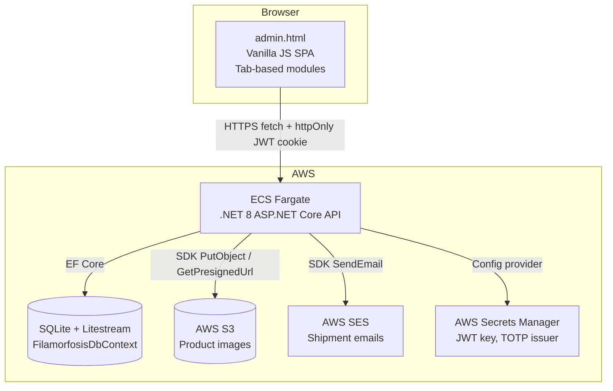
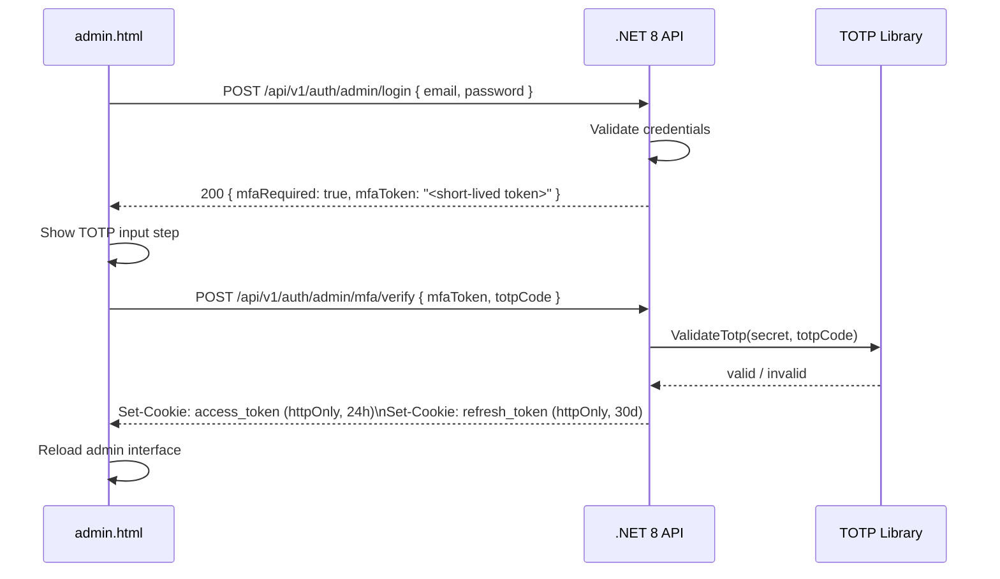
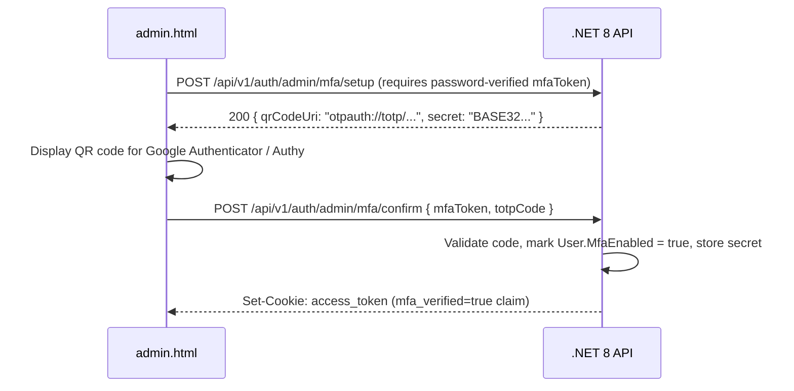
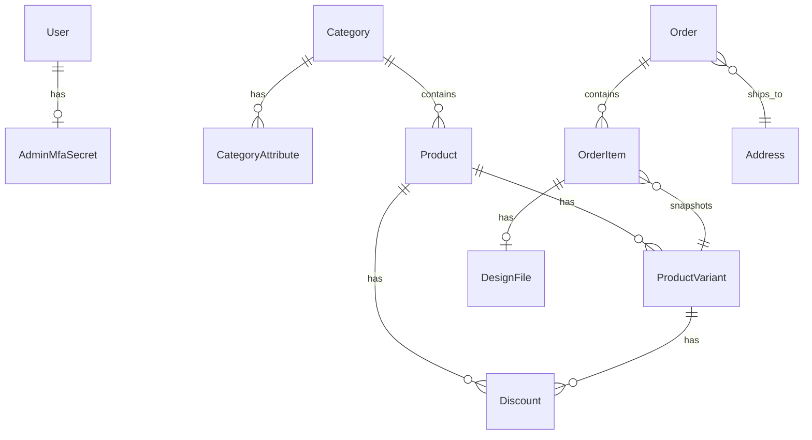
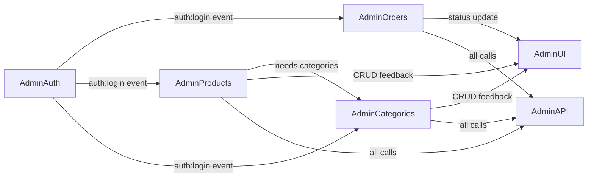

# Design Document — Admin Store Management

## Overview

This document describes the technical design for the Filamorfosis® Admin Store Management feature — a fully browser-based administration panel (`admin.html`) that lets privileged Admin users manage every aspect of the store without touching code or the database directly.

The feature extends the existing `admin.html` page and the `.NET 8` ASP.NET Core API to add:

- **MFA-protected admin authentication** — mandatory TOTP-based two-factor authentication for all Admin logins
- **Category management** — full CRUD including `CategoryAttribute` dimensions (Type, Color, Size)
- **Product management** — full CRUD for products, variants, stock, images (S3), and discounts
- **Order approval workflow** — state machine advancing orders through `Paid → Preparing → Shipped → Delivered`, with AWS SES shipment notifications

The admin panel preserves the existing dark-theme visual identity (`#0a0e1a`, Poppins, gradient accents `#6366f1 → #8b5cf6 → #ec4899`) and is built with vanilla HTML5/CSS3/JS — no framework.

---

## Architecture



### Request Flow

1. Admin navigates to `admin.html`.
2. `admin-auth.js` reads the `access_token` httpOnly cookie via `GET /api/v1/users/me` — if absent or non-Admin, the MFA login modal is shown.
3. All admin data operations call `/api/v1/admin/*` endpoints with the JWT cookie automatically attached by the browser.
4. The API validates the JWT, checks the `Admin` role claim, and — for MFA-sensitive operations — checks the `mfa_verified` claim in the token.

### MFA Authentication Flow



**First-time MFA enrollment:**



---

## Components and Interfaces

### Backend Layers

```
Filamorfosis.Domain          — Entities (new: CategoryAttribute, Discount, AdminMfaSecret)
Filamorfosis.Application     — DTOs (new: MFA, Discount, CategoryAttribute request/response types)
Filamorfosis.Infrastructure  — EF Core migrations, TOTP service, updated DbContext
Filamorfosis.API             — Controllers (new: AdminAuthController, AdminDiscountsController)
```

### New / Updated API Controllers

| Controller | Route Prefix | Responsibility |
|---|---|---|
| `AdminAuthController` | `/api/v1/auth/admin` | Two-step admin login, MFA setup, MFA verify, MFA confirm |
| `AdminCategoriesController` | `/api/v1/admin/categories` | Category CRUD + CategoryAttribute management |
| `AdminProductsController` | `/api/v1/admin/products` | Product + Variant CRUD, image upload/delete |
| `AdminDiscountsController` | `/api/v1/admin` | Discount create/delete on products and variants |
| `AdminOrdersController` | `/api/v1/admin/orders` | Order list, detail, status advancement, design files |

### Frontend Modules (`admin.html` inline scripts / separate JS files)

| Module | Responsibility |
|---|---|
| `admin-auth.js` | Two-step login modal (password → TOTP), MFA setup QR flow, session guard |
| `admin-categories.js` | Categories tab: list, add, edit, delete, attribute management |
| `admin-products.js` | Products tab: list, add, edit, delete, variant sub-table, image upload, discount forms |
| `admin-orders.js` | Orders tab: list with filters, order detail modal, status advancement |
| `admin-api.js` | Thin `apiFetch` wrapper for all `/api/v1/admin/*` calls |
| `admin-ui.js` | Shared helpers: `toast()`, `spin()`, `confirm()`, pagination controls |

---

## Data Models

### Entity Relationship Diagram



### New Domain Entities

#### AdminMfaSecret
```csharp
public class AdminMfaSecret
{
    public Guid   Id          { get; set; }
    public Guid   UserId      { get; set; }
    public string SecretBase32 { get; set; } = string.Empty;  // encrypted at rest
    public bool   IsConfirmed { get; set; }
    public DateTime CreatedAt { get; set; }
    public User   User        { get; set; } = null!;
}
```

#### CategoryAttribute
```csharp
public class CategoryAttribute
{
    public Guid   Id            { get; set; }
    public Guid   CategoryId    { get; set; }
    public string AttributeType { get; set; } = string.Empty;  // "Type" | "Color" | "Size"
    public string Value         { get; set; } = string.Empty;
    public Category Category    { get; set; } = null!;
}
```

#### Discount
```csharp
public class Discount
{
    public Guid      Id             { get; set; }
    public Guid?     ProductId      { get; set; }       // null if variant-level
    public Guid?     ProductVariantId { get; set; }     // null if product-level
    public string    DiscountType   { get; set; } = string.Empty;  // "Percentage" | "FixedAmount"
    public decimal   Value          { get; set; }
    public DateTime? StartsAt       { get; set; }
    public DateTime? EndsAt         { get; set; }
    public DateTime  CreatedAt      { get; set; }
    public Product?  Product        { get; set; }
    public ProductVariant? Variant  { get; set; }
}
```

### Updated Entities

#### User (extended)
```csharp
// Added navigation property
public AdminMfaSecret? MfaSecret { get; set; }
```

#### Category (extended)
```csharp
// Added navigation property
public ICollection<CategoryAttribute> Attributes { get; set; } = new List<CategoryAttribute>();
```

#### ProductVariant (extended)
```csharp
// Added navigation property
public ICollection<Discount> Discounts { get; set; } = new List<Discount>();
```

### Discount Calculation Logic

`effectivePrice` is computed at query time (not stored) using this priority:

1. Find all `Discount` records for the variant (direct) or its parent product (inherited).
2. Filter to only those where `StartsAt <= UtcNow <= EndsAt` (or null bounds are treated as open).
3. If multiple active discounts exist, apply the one with the highest resulting reduction.
4. Apply the formula:
   - `Percentage`: `effectivePrice = price * (1 - value / 100)`
   - `FixedAmount`: `effectivePrice = max(0, price - value)`
5. If no active discount: `effectivePrice = price`.

```csharp
public static decimal ComputeEffectivePrice(decimal price, IEnumerable<Discount> discounts)
{
    var now = DateTime.UtcNow;
    var active = discounts.Where(d =>
        (d.StartsAt == null || d.StartsAt <= now) &&
        (d.EndsAt   == null || d.EndsAt   >= now));

    return active.Aggregate(price, (best, d) =>
    {
        var candidate = d.DiscountType == "Percentage"
            ? price * (1 - d.Value / 100m)
            : Math.Max(0, price - d.Value);
        return candidate < best ? candidate : best;
    });
}
```

### Order Status State Machine

Valid transitions (admin-driven):

```
Paid ──► Preparing ──► Shipped ──► Delivered
```

All other transitions (e.g., `Preparing → Paid`, `Shipped → Preparing`) are rejected with `422 Unprocessable Entity`. The `Cancelled` and `PaymentFailed` statuses are set only by the payment webhook and cannot be set by the admin workflow.

```csharp
private static readonly Dictionary<OrderStatus, OrderStatus[]> AllowedTransitions = new()
{
    [OrderStatus.Paid]      = [OrderStatus.Preparing],
    [OrderStatus.Preparing] = [OrderStatus.Shipped],
    [OrderStatus.Shipped]   = [OrderStatus.Delivered],
    [OrderStatus.Delivered] = [],
};
```

---

## API Endpoint Design

### Admin Authentication (`/api/v1/auth/admin`)

```
POST /api/v1/auth/admin/login
  Body: { email, password }
  Response 200: { mfaRequired: true, mfaToken: "<jwt, 5min TTL, no admin access>" }
  Response 401: invalid credentials

POST /api/v1/auth/admin/mfa/setup
  Header: Authorization: Bearer <mfaToken>
  Response 200: { qrCodeUri: "otpauth://totp/Filamorfosis:<email>?secret=...&issuer=Filamorfosis", secret: "<base32>" }
  Response 403: mfaToken invalid or not an Admin

POST /api/v1/auth/admin/mfa/confirm
  Header: Authorization: Bearer <mfaToken>
  Body: { totpCode }
  Response 200: Set-Cookie access_token + refresh_token (mfa_verified=true claim)
  Response 422: invalid TOTP code

POST /api/v1/auth/admin/mfa/verify
  Header: Authorization: Bearer <mfaToken>
  Body: { totpCode }
  Response 200: Set-Cookie access_token + refresh_token (mfa_verified=true claim)
  Response 422: invalid or replayed TOTP code
```

The `mfaToken` is a short-lived JWT (5-minute TTL) containing the user ID and a `mfa_step: "pending"` claim. It grants no access to admin endpoints — it only authorizes the MFA verification step. The final `access_token` issued after successful TOTP verification includes a `mfa_verified: true` claim. All `/api/v1/admin/*` endpoints require this claim in addition to the `Admin` role.

### Categories (`/api/v1/admin/categories`)

```
GET    /api/v1/admin/categories
         Response 200: CategoryDto[] (includes attributes)

POST   /api/v1/admin/categories
         Body: { slug, nameEs, nameEn, imageUrl? }
         Response 201: CategoryDto

PUT    /api/v1/admin/categories/{id}
         Body: { nameEs?, nameEn?, slug?, imageUrl? }
         Response 200: CategoryDto

DELETE /api/v1/admin/categories/{id}
         Response 200: { id, isActive: false }
         Response 409: category has active products

POST   /api/v1/admin/categories/{id}/attributes
         Body: { attributeType: "Type"|"Color"|"Size", value }
         Response 201: CategoryAttributeDto

DELETE /api/v1/admin/categories/{id}/attributes/{attributeId}
         Response 204
```

### Products (`/api/v1/admin/products`)

```
GET    /api/v1/admin/products
         ?page&pageSize&categoryId&search
         Response 200: PagedResult<ProductDetailDto>

POST   /api/v1/admin/products
         Body: { titleEs, titleEn, descriptionEs, descriptionEn, categoryId, tags[], isActive }
         Response 201: ProductDetailDto

GET    /api/v1/admin/products/{id}
         Response 200: ProductDetailDto (includes variants + discounts)

PUT    /api/v1/admin/products/{id}
         Body: partial product fields
         Response 200: ProductDetailDto

DELETE /api/v1/admin/products/{id}
         Response 200: { id, isActive: false }

POST   /api/v1/admin/products/{id}/variants
         Body: { labelEs, labelEn, sku, price, stockQuantity, isAvailable, acceptsDesignFile }
         Response 201: ProductVariantDto

PUT    /api/v1/admin/products/{id}/variants/{variantId}
         Body: partial variant fields
         Response 200: ProductVariantDto

DELETE /api/v1/admin/products/{id}/variants/{variantId}
         Response 204
         Response 409: variant referenced by OrderItems

POST   /api/v1/admin/products/{id}/images
         Body: multipart/form-data (file: PNG|JPG, max 10 MB)
         Response 200: { imageUrls: string[] }

DELETE /api/v1/admin/products/{id}/images
         Body: { imageUrl }
         Response 200: { imageUrls: string[] }
```

### Discounts (`/api/v1/admin`)

```
POST   /api/v1/admin/products/{id}/discounts
         Body: { discountType, value, startsAt?, endsAt? }
         Response 201: DiscountDto
         Response 422: endsAt < startsAt

POST   /api/v1/admin/products/{id}/variants/{variantId}/discounts
         Body: { discountType, value, startsAt?, endsAt? }
         Response 201: DiscountDto
         Response 422: endsAt < startsAt

DELETE /api/v1/admin/discounts/{discountId}
         Response 204
```

### Orders (`/api/v1/admin/orders`)

```
GET    /api/v1/admin/orders
         ?page&pageSize&status&search
         Response 200: PagedResult<OrderSummaryDto>

GET    /api/v1/admin/orders/{orderId}
         Response 200: OrderDetailDto (items, address, customer email, status)

PUT    /api/v1/admin/orders/{orderId}/status
         Body: { status: "Preparing"|"Shipped"|"Delivered" }
         Response 200: { orderId, status }
         Response 422: invalid transition

GET    /api/v1/admin/orders/{orderId}/design-files
         Response 200: { designFileId, fileName, presignedUrl }[]
```

---

## Frontend Architecture (`admin.html`)

### Tab-Based SPA Structure

```
admin.html
├── <nav> — navbar with admin name + logout
├── #login-modal — two-step MFA login overlay
│   ├── Step 1: email + password form
│   └── Step 2: TOTP code input
├── #mfa-setup-modal — QR code enrollment overlay
├── .admin-tabs — tab buttons (Orders | Products | Categories)
├── #panel-orders — Orders tab
│   ├── Filter bar (status dropdown, search input)
│   ├── Paginated orders table
│   └── Order detail modal (items, address, status control)
├── #panel-products — Products tab
│   ├── Search input + "New Product" toggle
│   ├── Paginated products table
│   │   └── Expandable rows: variants sub-table + image manager + discount forms
│   └── Add/Edit product inline forms
└── #panel-categories — Categories tab
    ├── "New Category" toggle
    ├── Categories table
    │   └── Expandable rows: attributes grouped by Type/Color/Size
    └── Add/Edit category inline forms
```

### Module Interaction



### MFA Login UI Flow

```
[admin.html loads]
       │
       ▼
[GET /api/v1/users/me]
       │
  ┌────┴────┐
  │ 401 /   │                    │ 200, role=Admin,
  │ no Admin│                    │ mfa_verified=true
  └────┬────┘                    └──► render admin interface
       │
       ▼
[Show Step 1: email + password]
       │
       ▼
[POST /auth/admin/login]
       │
  ┌────┴────────────────────────┐
  │ mfaRequired: true           │ 401 → show error
  └────┬────────────────────────┘
       │
       ▼
[Show Step 2: TOTP input]
  (if !mfaEnabled → show QR setup first)
       │
       ▼
[POST /auth/admin/mfa/verify]
       │
  ┌────┴────────────────────────┐
  │ 200 → cookies set           │ 422 → show "Código inválido"
  └────┬────────────────────────┘
       │
       ▼
[location.reload() → render admin interface]
```

### Pagination and State

Each tab module maintains its own local state object:

```javascript
// Example: orders module state
const ordersState = {
  page: 1,
  pageSize: 20,
  status: '',       // filter
  search: '',       // filter
  total: 0,
  items: []
};
```

Page navigation calls the API with updated `page` param and re-renders the table body in place — no full reload.

---

## AWS Integrations

### S3 — Product Image Storage

- **Upload**: `POST /api/v1/admin/products/{id}/images` receives a multipart file, validates MIME type and size, then calls `IS3Service.UploadAsync(stream, key, contentType)` with key pattern `products/{productId}/{uuid}-{filename}`.
- **Delete**: The image URL (S3 key) is removed from `Product.ImageUrls`; the S3 object is deleted via `IS3Service.DeleteAsync(key)`.
- **Public access**: Product images are served via CloudFront (public bucket policy). The stored key is converted to a full CDN URL for display.

### SES — Shipment Notification Email

Triggered when an admin advances an order to `Shipped`:

```csharp
await emailService.SendShipmentNotificationAsync(order.User.Email, order.Id);
```

The email is sent fire-and-forget in a background `Task.Run` to avoid blocking the API response. Failures are logged via `ILogger` but do not roll back the status update.

**Email template** (`shipment-notification`):
- Subject: "Tu pedido ha sido enviado — Filamorfosis®"
- Body: order ID, items summary, estimated delivery note, link to `account.html`

### Secrets Manager

New secrets added for MFA:
- `/filamorfosis/prod/totp-issuer` — issuer name shown in authenticator apps (e.g., `"Filamorfosis"`)
- The TOTP secret per user is stored encrypted in the `AdminMfaSecret` table using AES-256 with a key from Secrets Manager.

---

## Security Considerations

### JWT + MFA Claim

The standard `access_token` issued after password-only login does **not** include `mfa_verified`. A separate two-step flow issues a short-lived `mfaToken` (5 min, no admin access), and only after successful TOTP verification does the API issue the full `access_token` with `mfa_verified: true`.

All `/api/v1/admin/*` endpoints are protected by a custom `[RequireMfa]` attribute that checks:
1. `ClaimTypes.Role == "Admin"`
2. `"mfa_verified" claim == "true"`

```csharp
public class RequireMfaAttribute : AuthorizeAttribute, IAuthorizationRequirement
{
    // Policy: Admin role + mfa_verified claim
}
```

### TOTP Implementation

- Library: `Otp.NET` (NuGet) — RFC 6238 compliant, no custom TOTP implementation.
- Secret: 20-byte random secret, Base32-encoded, stored AES-256 encrypted in `AdminMfaSecret.SecretBase32`.
- Window: ±1 step (30-second window) to tolerate minor clock skew.
- Replay protection: last used TOTP code stored per user; same code rejected within the same 30-second window.

### Role Enforcement

- All `/api/v1/admin/*` controllers carry `[Authorize(Roles = "Admin")]` + `[RequireMfa]`.
- The `AuthController` admin endpoints (`/api/v1/auth/admin/*`) use a lighter `[Authorize]` with only the `mfaToken` JWT — no admin role required at that step.

### CORS

The existing `FrontendPolicy` CORS configuration (`WithOrigins(frontendOrigin).AllowCredentials()`) covers `admin.html` since it is served from the same origin as the rest of the frontend.

### Rate Limiting

The existing `"login"` rate limiter (10 req/min/IP) is applied to `POST /api/v1/auth/admin/login`. The MFA verify endpoint gets its own stricter limiter: 5 attempts/min/IP to prevent TOTP brute-force.

```csharp
options.AddFixedWindowLimiter("mfa-verify", o =>
{
    o.PermitLimit = 5;
    o.Window = TimeSpan.FromMinutes(1);
});
```

### Input Validation

- All request bodies validated with FluentValidation before reaching controller logic.
- `discountType` validated against the enum `["Percentage", "FixedAmount"]`.
- `attributeType` validated against `["Type", "Color", "Size"]`.
- Image uploads: MIME type whitelist (`image/png`, `image/jpeg`) + max 10 MB enforced in middleware before S3 upload.

---

## Error Handling

All error responses follow RFC 7807 Problem Details:

```json
{
  "type": "https://filamorfosis.com/errors/<error-code>",
  "title": "Human-readable title",
  "status": 422,
  "detail": "Specific explanation shown to the admin UI."
}
```

| Scenario | HTTP Status | `detail` |
|---|---|---|
| Invalid TOTP code | 422 | "El código de verificación es incorrecto o ha expirado." |
| Replayed TOTP code | 422 | "Este código ya fue utilizado. Espera el siguiente." |
| MFA not confirmed | 403 | "MFA enrollment is required before accessing admin resources." |
| Delete category with active products | 409 | "Cannot delete category: N active products are assigned to it." |
| Delete variant referenced by orders | 409 | "Cannot delete variant: it is referenced by existing orders." |
| Discount endsAt < startsAt | 422 | "endsAt must be after startsAt." |
| Invalid order status transition | 422 | "Invalid transition from X to Y. Allowed next statuses: [Z]." |
| Image too large | 422 | "Image exceeds 10 MB limit." |
| Invalid image type | 422 | "Only PNG and JPG images are accepted." |

The admin frontend reads the `detail` field from every non-2xx response and displays it inline near the relevant form or action button.

---

## Testing Strategy

### Unit Tests

Focus on pure logic that doesn't require the database or external services:

- `ComputeEffectivePrice` — all discount type/date combinations
- `AllowedTransitions` state machine — all valid and invalid transitions
- `ValidateTotp` — valid code accepted, expired code rejected, replayed code rejected
- `CategoryAttribute` type validation
- Discount date range validation (`endsAt < startsAt`)

### Integration Tests (WebApplicationFactory)

- Full MFA login flow: password step → mfaToken → TOTP verify → access_token with `mfa_verified`
- Admin endpoint returns 401 without JWT
- Admin endpoint returns 403 with Customer-role JWT
- Admin endpoint returns 403 with Admin JWT missing `mfa_verified` claim
- Category CRUD round-trip (create → fetch → update → fetch → delete)
- Product + variant CRUD round-trip
- Discount effectivePrice reflected in product detail response
- Order status advancement: valid transitions succeed, invalid transitions return 422
- Order status update visible via customer `GET /api/v1/orders/{id}`
- SES email mock called exactly once when order advances to `Shipped`

### Property-Based Tests

Using `FsCheck` (F# / C# property-based testing library):

- Minimum 100 iterations per property
- Tag format: `// Feature: admin-store-management, Property N: <property text>`

---

## Correctness Properties

*A property is a characteristic or behavior that should hold true across all valid executions of a system — essentially, a formal statement about what the system should do. Properties serve as the bridge between human-readable specifications and machine-verifiable correctness guarantees.*

### Property 1: Admin endpoint authorization

*For any* HTTP request to any `/api/v1/admin/*` endpoint made without a valid JWT cookie, the API SHALL return `401 Unauthorized`.

**Validates: Requirements 1.4**

---

### Property 2: Admin endpoint role enforcement

*For any* HTTP request to any `/api/v1/admin/*` endpoint made with a valid JWT belonging to a user without the `Admin` role, the API SHALL return `403 Forbidden`.

**Validates: Requirements 1.5**

---

### Property 3: MFA enforcement on admin login

*For any* valid Admin credentials (correct email and password), the API SHALL NOT issue a full `access_token` without a subsequent valid TOTP code submission. A request to any `/api/v1/admin/*` endpoint using only the intermediate `mfaToken` SHALL return `403 Forbidden`.

**Validates: Requirements 1.8, 1.10, 1.11**

---

### Property 4: TOTP setup returns valid URI

*For any* Admin user calling `POST /api/v1/auth/admin/mfa/setup`, the returned `qrCodeUri` SHALL be a valid `otpauth://totp/` URI containing the issuer name and the admin's email address.

**Validates: Requirements 1.9**

---

### Property 5: Category data round-trip

*For any* valid category creation payload, creating a category via `POST /api/v1/admin/categories` and then fetching it via `GET /api/v1/admin/categories` SHALL return a category whose `slug`, `nameEs`, and `nameEn` exactly match the submitted values.

**Validates: Requirements 2.2, 2.3**

---

### Property 6: Category delete conflict

*For any* category that has one or more active products assigned to it, a `DELETE /api/v1/admin/categories/{id}` request SHALL return `409 Conflict`.

**Validates: Requirements 2.5**

---

### Property 7: Product pagination invariant

*For any* page number and page size, the number of items returned by `GET /api/v1/admin/products?page=P&pageSize=N` SHALL be at most N, and the `totalCount` field SHALL equal the actual number of products in the database.

**Validates: Requirements 3.1**

---

### Property 8: Variant delete conflict

*For any* `ProductVariant` that is referenced by one or more `OrderItem` records, a `DELETE /api/v1/admin/products/{id}/variants/{variantId}` request SHALL return `409 Conflict`.

**Validates: Requirements 3.9**

---

### Property 9: Discount effectivePrice calculation

*For any* `ProductVariant` with a base `price` and an active `Discount`, the `effectivePrice` returned in all product and variant API responses SHALL equal:
- `price * (1 - value / 100)` for `Percentage` discounts
- `max(0, price - value)` for `FixedAmount` discounts
- `price` when no discount is active or all discounts are outside their date range

**Validates: Requirements 4.4, 4.5, 4.6, 4.7**

---

### Property 10: Order status workflow state machine

*For any* order in a given status, a `PUT /api/v1/admin/orders/{id}/status` request SHALL succeed (200) only for the single allowed next status in the sequence `Paid → Preparing → Shipped → Delivered`, and SHALL return `422 Unprocessable Entity` for any other target status.

**Validates: Requirements 5.3, 5.4**

---

### Property 11: Order status visibility to customer

*For any* order whose status is updated by an Admin via `PUT /api/v1/admin/orders/{id}/status`, a subsequent `GET /api/v1/orders/{id}` by the order's owner SHALL return the updated status.

**Validates: Requirements 5.8, 6.1**
