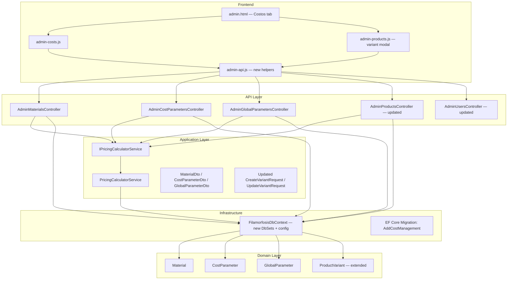

# Design Document — Cost Management and Pricing

## Overview

This feature adds a complete cost management and pricing subsystem to the Filamorfosis admin
panel. It introduces three new domain entities (`Material`, `CostParameter`, `GlobalParameter`),
a `PricingCalculatorService` that implements five category-specific formulas, a new "Costos"
admin tab, and updates to the variant edit modal so that `Price` is always derived from cost
inputs rather than entered manually.

The design follows the existing clean-architecture layering:
`Domain → Application → Infrastructure → API`, with vanilla JS modules on the frontend.

---

## Architecture



### Key Design Decisions

- `PricingCalculatorService` is **pure logic** — it receives all inputs as parameters and reads
  `TaxRate` from the database at call time (no caching), satisfying Requirement 7.8.
- `Price` on `ProductVariant` is **always computed** by the service on save; the admin cannot
  set it directly.
- `CostParameter` uses an **upsert** pattern (`PUT /{category}/{key}`) to avoid separate
  create/update flows for parameters that are seeded on first run.
- The "Costos" tab is **role-gated** in the same `TAB_PERMISSIONS` map already used by the
  existing tab visibility logic.
- Multi-role support replaces the single-role `PUT /role` endpoint with a new
  `PUT /roles` endpoint that accepts a list, preserving backward compatibility by keeping the
  old endpoint for the "promote to admin" flow.

---

## Components and Interfaces

### Backend — New Controllers

#### `AdminMaterialsController`
```
Route:    /api/v1/admin/materials
Auth:     [Authorize(Roles = "Master,PriceManagement")] + [RequireMfa]
```

| Method | Path              | Description                                      |
|--------|-------------------|--------------------------------------------------|
| GET    | /                 | Paginated list, optional `?category=` filter     |
| POST   | /                 | Create material → 201                            |
| PUT    | /{id}             | Update material → 200                            |
| DELETE | /{id}             | Delete if unreferenced → 204, else 409           |

#### `AdminCostParametersController`
```
Route:    /api/v1/admin/cost-parameters
Auth:     [Authorize(Roles = "Master,PriceManagement")] + [RequireMfa]
```

| Method | Path                    | Description                          |
|--------|-------------------------|--------------------------------------|
| GET    | /                       | All parameters grouped by Category   |
| PUT    | /{category}/{key}       | Upsert a parameter → 200             |

#### `AdminGlobalParametersController`
```
Route:    /api/v1/admin/global-parameters
Auth:     [Authorize(Roles = "Master,PriceManagement")] + [RequireMfa]
```

| Method | Path   | Description                                      |
|--------|--------|--------------------------------------------------|
| GET    | /      | All global parameters                            |
| PUT    | /{key} | Update by key → 200, 404 if not found            |

### Backend — Updated Controllers

#### `AdminUsersController` changes
- Add `PriceManagement` to `ValidAdminRoles` and `ValidAssignableRoles`.
- Add new endpoint `PUT /api/v1/admin/users/{userId}/roles` accepting
  `UpdateUserRolesRequest { List<string> Roles }` — replaces all current roles with the
  supplied list; returns 400 if list is empty or contains invalid roles; returns 403 on
  self-modification.
- Update `POST /api/v1/admin/users` to accept `List<string>? Roles` (defaults to
  `["OrderManagement"]`).
- Keep existing `PUT /role` endpoint unchanged for backward compatibility.

#### `AdminProductsController` changes
- `CreateVariant` and `UpdateVariant` accept new cost fields (see DTOs below).
- On save, inject `IPricingCalculatorService` and call `ComputePrice` to set `Price`.
- `MapVariant` includes new fields in `ProductVariantDto`.
- Include `Material` navigation in queries that load variants.

### Application Layer — `IPricingCalculatorService`

```csharp
public interface IPricingCalculatorService
{
    /// <summary>
    /// Computes BaseCost for a variant based on its category's formula.
    /// Throws ArgumentOutOfRangeException if any input is negative.
    /// </summary>
    Task<decimal> ComputeBaseCostAsync(ComputeBaseCostRequest request);

    /// <summary>
    /// Computes the tax-inclusive Price.
    /// Price = (baseCost + profit) × (1 + taxRate)
    /// Reads TaxRate from GlobalParameter at call time.
    /// Throws ArgumentOutOfRangeException if baseCost, profit, or taxRate is negative.
    /// </summary>
    Task<decimal> ComputePriceAsync(decimal baseCost, decimal profit);

    /// <summary>
    /// Overload that accepts an explicit taxRate (for preview/testing).
    /// </summary>
    decimal ComputePrice(decimal baseCost, decimal profit, decimal taxRate);
}

public record ComputeBaseCostRequest(
    string Category,           // "UV Printing" | "3D Printing" | "Laser Engraving" | "Laser Cutting" | "Photo Printing"
    decimal MaterialBaseCost,
    decimal? WidthCm,
    decimal? HeightCm,
    int? ManufactureTimeMinutes,
    decimal? FilamentGrams,
    string? PrintType,         // "Flat" | "Relief" (UV only)
    // Cost parameters resolved by the service from CostParameter table
    IReadOnlyDictionary<string, decimal> CostParams
);
```

### Frontend — New Files

#### `assets/js/admin-costs.js`
Manages the "Costos" tab:
- `AdminCosts.loadAll()` — fetches materials, cost parameters, and global parameters in
  parallel.
- `AdminCosts.renderMaterialsTable()` — renders the materials table.
- `AdminCosts.openAddMaterialModal()` / `openEditMaterialModal(id)` — modal CRUD.
- `AdminCosts.renderCostParameters()` — renders grouped parameter rows with inline save.
- `AdminCosts.renderGlobalParameters()` — renders global parameter rows with inline save.

### Frontend — Updated Files

#### `assets/js/admin-api.js` additions
```js
// Materials
adminGetMaterials(params)           // GET /admin/materials?category=...
adminCreateMaterial(data)           // POST /admin/materials
adminUpdateMaterial(id, data)       // PUT /admin/materials/{id}
adminDeleteMaterial(id)             // DELETE /admin/materials/{id}

// Cost Parameters
adminGetCostParameters()            // GET /admin/cost-parameters
adminUpsertCostParameter(category, key, data)  // PUT /admin/cost-parameters/{category}/{key}

// Global Parameters
adminGetGlobalParameters()          // GET /admin/global-parameters
adminUpdateGlobalParameter(key, data) // PUT /admin/global-parameters/{key}

// Users — multi-role
adminUpdateUserRoles(userId, roles) // PUT /admin/users/{userId}/roles
```

#### `assets/js/admin-products.js` additions
- Load materials list on variant modal open.
- Populate material dropdown; on selection, auto-fill read-only display fields.
- Show/hide process-specific fields based on material category.
- Real-time price preview: `(baseCost + profit) × (1 + taxRate)`.
- Include new cost fields in create/update variant payloads.

#### `assets/js/admin-users.js` changes
- Replace single-role `<select>` with a checkbox group for each role.
- On submit, collect checked roles into an array and call `adminUpdateUserRoles`.
- Display all roles as individual badges (already partially done).

---

## Data Models

### Domain Entities

#### `Material`
```csharp
public class Material
{
    public Guid Id { get; set; }
    public string Name { get; set; } = string.Empty;       // required
    public string Category { get; set; } = string.Empty;   // printing category name
    public string? SizeLabel { get; set; }
    public decimal? WidthCm { get; set; }
    public decimal? HeightCm { get; set; }
    public int? WeightGrams { get; set; }
    public decimal BaseCost { get; set; }                  // MXN, >= 0
    public DateTime CreatedAt { get; set; }

    // Navigation
    public ICollection<ProductVariant> Variants { get; set; } = new List<ProductVariant>();
}
```

#### `CostParameter`
```csharp
public class CostParameter
{
    public Guid Id { get; set; }
    public string Category { get; set; } = string.Empty;   // e.g. "UV Printing"
    public string Key { get; set; } = string.Empty;        // e.g. "electric_cost_per_hour"
    public string Label { get; set; } = string.Empty;      // human-readable
    public decimal Value { get; set; }                     // >= 0
    public DateTime UpdatedAt { get; set; }
}
// Unique index: (Category, Key)
```

#### `GlobalParameter`
```csharp
public class GlobalParameter
{
    public Guid Id { get; set; }
    public string Key { get; set; } = string.Empty;        // unique, e.g. "tax_rate"
    public string Label { get; set; } = string.Empty;      // e.g. "IVA (%)"
    public string Value { get; set; } = string.Empty;      // stored as string, e.g. "0.16"
    public DateTime UpdatedAt { get; set; }
}
// Unique index: Key
```

#### `ProductVariant` — new fields
```csharp
// Added to existing ProductVariant entity:
public Guid? MaterialId { get; set; }
public Material? Material { get; set; }
public decimal BaseCost { get; set; } = 0;
public decimal Profit { get; set; } = 0;
public int? ManufactureTimeMinutes { get; set; }
public decimal? FilamentGrams { get; set; }
public string? PrintType { get; set; }   // "Flat" | "Relief" | null
```

### DTOs

#### `MaterialDto`
```csharp
public class MaterialDto
{
    public Guid Id { get; set; }
    public string Name { get; set; } = string.Empty;
    public string Category { get; set; } = string.Empty;
    public string? SizeLabel { get; set; }
    public decimal? WidthCm { get; set; }
    public decimal? HeightCm { get; set; }
    public int? WeightGrams { get; set; }
    public decimal BaseCost { get; set; }
    public DateTime CreatedAt { get; set; }
}
```

#### `CostParameterDto`
```csharp
public class CostParameterDto
{
    public Guid Id { get; set; }
    public string Category { get; set; } = string.Empty;
    public string Key { get; set; } = string.Empty;
    public string Label { get; set; } = string.Empty;
    public decimal Value { get; set; }
    public DateTime UpdatedAt { get; set; }
}
```

#### `GlobalParameterDto`
```csharp
public class GlobalParameterDto
{
    public Guid Id { get; set; }
    public string Key { get; set; } = string.Empty;
    public string Label { get; set; } = string.Empty;
    public string Value { get; set; } = string.Empty;
    public DateTime UpdatedAt { get; set; }
}
```

#### Updated `ProductVariantDto`
```csharp
// New fields added to existing ProductVariantDto:
public Guid? MaterialId { get; set; }
public string? MaterialName { get; set; }
public decimal BaseCost { get; set; }
public decimal Profit { get; set; }
public int? ManufactureTimeMinutes { get; set; }
public decimal? FilamentGrams { get; set; }
public string? PrintType { get; set; }
```

#### Updated `CreateVariantRequest` / `UpdateVariantRequest`
```csharp
// New fields added to both request types:
public Guid? MaterialId { get; set; }
public decimal Profit { get; set; } = 0;
public int? ManufactureTimeMinutes { get; set; }
public decimal? FilamentGrams { get; set; }
public string? PrintType { get; set; }
```

#### New request types
```csharp
public record CreateMaterialRequest(
    string Name,
    string Category,
    string? SizeLabel,
    decimal? WidthCm,
    decimal? HeightCm,
    int? WeightGrams,
    decimal BaseCost
);

public record UpdateMaterialRequest(
    string? Name,
    string? Category,
    string? SizeLabel,
    decimal? WidthCm,
    decimal? HeightCm,
    int? WeightGrams,
    decimal? BaseCost
);

public record UpsertCostParameterRequest(
    string Label,
    decimal Value
);

public record UpdateGlobalParameterRequest(
    string Value
);

public record UpdateUserRolesRequest(
    List<string> Roles
);
```

### EF Core Migration: `AddCostManagement`

Changes applied in a single migration:

1. **New table `Materials`** — all fields above, index on `Name`.
2. **New table `CostParameters`** — unique index on `(Category, Key)`.
3. **New table `GlobalParameters`** — unique index on `Key`.
4. **Alter `ProductVariants`** — add columns: `MaterialId` (nullable FK → `Materials.Id`,
   `ON DELETE SET NULL`), `BaseCost` (decimal, default 0), `Profit` (decimal, default 0),
   `ManufactureTimeMinutes` (int, nullable), `FilamentGrams` (decimal, nullable),
   `PrintType` (nvarchar, nullable).
5. **Seed data** — insert default `CostParameter` rows for all five categories and the
   `tax_rate` `GlobalParameter` (applied in `OnModelCreating` data seeding or via a
   migration-time `HasData` call).

`DbContext` additions:
```csharp
public DbSet<Material> Materials => Set<Material>();
public DbSet<CostParameter> CostParameters => Set<CostParameter>();
public DbSet<GlobalParameter> GlobalParameters => Set<GlobalParameter>();
```

---

## Correctness Properties

*A property is a characteristic or behavior that should hold true across all valid executions
of a system — essentially, a formal statement about what the system should do. Properties serve
as the bridge between human-readable specifications and machine-verifiable correctness
guarantees.*

The `PricingCalculatorService` is a pure computation layer with no side effects on its core
math, making it ideal for property-based testing. The properties below are implemented using
**FsCheck** (the standard PBT library for .NET/xUnit) with a minimum of 100 iterations each.

### Property 1: Price formula correctness

*For any* non-negative `BaseCost` value `b`, non-negative `Profit` value `p`, and non-negative
`TaxRate` value `t`, calling `ComputePrice(b, p, t)` SHALL return exactly `(b + p) × (1 + t)`.

**Validates: Requirements 4.2, 4.7**

---

### Property 2: Zero-profit identity

*For any* non-negative `BaseCost` value `b` and non-negative `TaxRate` value `t`,
`ComputePrice(b, profit: 0, t)` SHALL equal `b × (1 + t)`.

**Validates: Requirements 4.8**

---

### Property 3: Negative inputs throw

*For any* negative value supplied as `BaseCost`, `Profit`, or `TaxRate`,
`PricingCalculatorService` SHALL throw `ArgumentOutOfRangeException` and SHALL NOT return a
result.

**Validates: Requirements 4.3, 4.4, 4.5**

---

### Property 4: UV Printing BaseCost formula

*For any* non-negative `Material.BaseCost`, non-negative `PrintArea` (`WidthCm × HeightCm`),
non-negative `ManufactureTimeMinutes`, non-negative `InkCostPerCm2`, non-negative
`ElectricCostPerHour`, and `PrintType` ∈ `{"Flat", "Relief"}`, the computed `BaseCost` SHALL
equal:

```
Material.BaseCost + (PrintArea × InkCostPerCm2) + (ManufactureTimeMinutes / 60 × ElectricCostPerHour)
```

where `InkCostPerCm2` is `ink_cost_flat_per_cm2` when `PrintType = "Flat"` and
`ink_cost_relief_per_cm2` when `PrintType = "Relief"`.

**Validates: Requirements 4.1 (UV Printing)**

---

### Property 5: 3D Printing BaseCost formula

*For any* non-negative `Material.BaseCost`, non-negative `FilamentGrams`, non-negative
`ManufactureTimeMinutes`, non-negative `FilamentCostPerGram`, and non-negative
`ElectricCostPerHour`, the computed `BaseCost` SHALL equal:

```
Material.BaseCost + (FilamentGrams × FilamentCostPerGram) + (ManufactureTimeMinutes / 60 × ElectricCostPerHour)
```

**Validates: Requirements 4.1 (3D Printing)**

---

### Property 6: Laser Engraving and Laser Cutting BaseCost formula

*For any* non-negative `Material.BaseCost`, non-negative `ManufactureTimeMinutes`, and
non-negative `ElectricCostPerHour`, the computed `BaseCost` for both `Laser Engraving` and
`Laser Cutting` categories SHALL equal:

```
Material.BaseCost + (ManufactureTimeMinutes / 60 × ElectricCostPerHour)
```

**Validates: Requirements 4.1 (Laser Engraving, Laser Cutting)**

---

### Property 7: Photo Printing BaseCost formula

*For any* non-negative `PrintArea` (`WidthCm × HeightCm`), non-negative `PaperCostPerCm2`,
non-negative `InkCostPerCm2`, non-negative `ManufactureTimeMinutes`, and non-negative
`ElectricCostPerHour`, the computed `BaseCost` SHALL equal:

```
(PrintArea × PaperCostPerCm2) + (PrintArea × InkCostPerCm2) + (ManufactureTimeMinutes / 60 × ElectricCostPerHour)
```

Note: `Material.BaseCost` is not added for Photo Printing because paper cost is already
captured via `PaperCostPerCm2`.

**Validates: Requirements 4.1 (Photo Printing)**

---

### Property 8: TaxRate update propagates to price computation

*For any* `TaxRate` value `t` in `[0, 1]`, non-negative `BaseCost` `b`, and non-negative
`Profit` `p`, after updating the `tax_rate` `GlobalParameter` to `t`, calling
`ComputePriceAsync(b, p)` SHALL return `(b + p) × (1 + t)`.

**Validates: Requirements 7.8, 7.9**

---

### Property 9: Variant price persistence round-trip

*For any* `ProductVariant` where `MaterialId` is set, after saving the variant via
`AdminProductsController`, fetching the product via `GET /api/v1/admin/products/{id}` SHALL
return a `Price` equal to `(BaseCost + Profit) × (1 + TaxRate)` where `BaseCost` was computed
by `PricingCalculatorService` at save time.

**Validates: Requirements 6.7, 6.12**

---

### Property 10: Role assignment round-trip

*For any* non-empty subset of valid roles (`Master`, `OrderManagement`, `ProductManagement`,
`UserManagement`, `PriceManagement`), assigning that subset to an admin user via
`PUT /api/v1/admin/users/{userId}/roles` and then fetching the user via
`GET /api/v1/admin/users` SHALL return exactly that subset of roles (no more, no less).

**Validates: Requirements 1.2, 1.6**

---

### Property 11: Material list ordering and category filter

*For any* set of `Material` records with varying `Name` and `Category` values:
- `GET /api/v1/admin/materials` SHALL return them ordered by `Name` ascending.
- `GET /api/v1/admin/materials?category=X` SHALL return only records whose `Category` equals
  `X`, still ordered by `Name` ascending.

**Validates: Requirements 2.1, 2.11**

---

## Error Handling

### Backend

| Scenario | HTTP Status | Detail |
|---|---|---|
| Material `Name` is blank | 400 | "El nombre del material es requerido." |
| Material `BaseCost` < 0 | 400 | "El costo base no puede ser negativo." |
| Material not found (PUT/DELETE) | 404 | "Material no encontrado." |
| DELETE material in use by variant | 409 | "El material está en uso por una o más variantes y no puede eliminarse." |
| CostParameter `Value` < 0 | 400 | "El valor del parámetro no puede ser negativo." |
| GlobalParameter key not found | 404 | "Parámetro no encontrado." |
| `tax_rate` value outside `[0, 1]` | 400 | "El valor de IVA debe estar entre 0 y 1." |
| Roles list empty | 400 | "Se requiere al menos un rol." |
| Invalid role string | 400 | "Rol inválido. Los valores permitidos son: ..." |
| Self-role modification | 403 | "No puedes modificar tu propia cuenta." |
| `PricingCalculatorService` negative input | `ArgumentOutOfRangeException` | Caught by controller → 400 |
| Unauthorized (missing role) | 401 / 403 | Standard ASP.NET Core Identity response |

All error responses follow the existing RFC 7807 `ProblemDetails` format used throughout the
API.

### Frontend

- Inline validation on material form: required fields highlighted before submit.
- Toast notifications for all API success/error responses (reusing existing `window.toast`).
- HTTP 409 on material delete → specific toast: "El material está en uso y no puede
  eliminarse."
- Real-time price preview shows `—` when `BaseCost` cannot be computed (no material selected).

---

## Testing Strategy

### Unit Tests (xUnit + Moq)

Focus on `PricingCalculatorService` since it contains all the business logic:

- **Example tests**: one concrete example per category formula verifying the exact numeric
  result.
- **Edge cases**: `ManufactureTimeMinutes = 0`, `FilamentGrams = 0`, `PrintArea = 0`,
  `Profit = 0`, `TaxRate = 0`.
- **Error cases**: negative `BaseCost`, negative `Profit`, negative `TaxRate` each throw
  `ArgumentOutOfRangeException`.
- Mock `FilamorfosisDbContext` (or use an in-memory SQLite) to supply `CostParameter` and
  `GlobalParameter` rows.

### Property-Based Tests (FsCheck + xUnit)

Use **FsCheck** (`FsCheck.Xunit` NuGet package). Each property test runs a minimum of
**100 iterations**. Tag each test with a comment referencing the design property.

Tag format: `// Feature: cost-management-and-pricing, Property {N}: {property_text}`

Properties to implement as PBT:

| Test class | Property | FsCheck generator |
|---|---|---|
| `PricingCalculatorServiceTests` | P1 — Price formula | `Gen.Choose(0, 10000)` for b, p; `Gen.Choose(0, 100)` for t (divide by 100) |
| `PricingCalculatorServiceTests` | P2 — Zero-profit identity | `Gen.Choose(0, 10000)` for b; `Gen.Choose(0, 100)` for t |
| `PricingCalculatorServiceTests` | P3 — Negative inputs throw | `Gen.Choose(-10000, -1)` for each negative input |
| `PricingCalculatorServiceTests` | P4 — UV formula | Generate random UV inputs |
| `PricingCalculatorServiceTests` | P5 — 3D formula | Generate random 3D inputs |
| `PricingCalculatorServiceTests` | P6 — Laser formula | Generate random laser inputs |
| `PricingCalculatorServiceTests` | P7 — Photo formula | Generate random photo inputs |
| `GlobalParameterTests` | P8 — TaxRate propagation | `Gen.Choose(0, 100)` for t (divide by 100) |
| `AdminProductsControllerTests` | P9 — Variant price round-trip | Generate random variant cost inputs |
| `AdminUsersControllerTests` | P10 — Role assignment round-trip | Generate random non-empty subsets of valid roles |
| `AdminMaterialsControllerTests` | P11 — Ordering + filter | Generate random material lists |

### Integration Tests (WebApplicationFactory)

- `POST /admin/materials` → `GET /admin/materials` round-trip.
- `PUT /admin/cost-parameters/{category}/{key}` upsert idempotency.
- `PUT /admin/global-parameters/tax_rate` → subsequent `ComputePriceAsync` uses new rate.
- `PUT /admin/users/{id}/roles` with multiple roles → `GET /admin/users` returns all roles.
- `DELETE /admin/materials/{id}` with referenced variant → 409.

### Frontend Tests

No automated frontend tests are added in this feature. Manual testing covers:
- Costos tab visibility per role.
- Material CRUD modal flows.
- Variant modal: material selection, conditional fields, real-time price preview.
- Role checkbox rendering and multi-role save.
