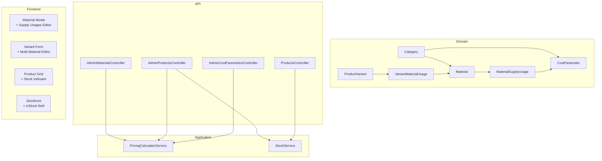

# Design Document — Material Supply Cost Model

## Overview

This feature migrates the Filamorfosis cost model from a variant-level supply-usage approach to a material-level one. The cascading chain becomes:

```
Category → CostParameters → Material (with MaterialSupplyUsages) → ProductVariant (with VariantMaterialUsages)
```

The two new join tables (`MaterialSupplyUsages`, `VariantMaterialUsages`) already exist as C# domain entities but are not yet wired to the DB context, migrations, or controllers. This design completes that wiring, removes the legacy `VariantSupplyUsages` table and the single `MaterialId` FK on `ProductVariant`, and updates the admin UI accordingly.

### Key Design Decisions

- **Cached BaseCost on Material**: Rather than computing material cost on every variant read, `Materials.BaseCost` is recomputed and persisted whenever supply usages or cost parameters change. This keeps variant cost reads cheap.
- **Cascade recompute on CostParameter update**: When a `CostParameter.Value` changes, all materials referencing it are recomputed immediately in the same request. Variants are recomputed lazily via a dedicated endpoint.
- **StockQuantity on Material, not Variant**: Variant stock is derived from its materials' `StockQuantity` values. The legacy `ProductVariants.StockQuantity` column is retained for backward compatibility with order/cart logic but is no longer the source of truth for in-stock display.
- **Replace-all semantics for usages**: Both `MaterialSupplyUsages` and `VariantMaterialUsages` use replace-all on save (delete existing rows, insert new ones). This keeps the API simple and avoids partial-update edge cases.

---

## Architecture



---

## Components and Interfaces

### PricingCalculatorService (updated)

The existing `IPricingCalculatorService` / `PricingCalculatorService` is extended with two new methods:

```csharp
/// <summary>
/// Computes Material_Base_Cost = Σ(CostParameter.Value × MaterialSupplyUsage.Quantity).
/// Returns 0 if usages is empty.
/// </summary>
decimal ComputeMaterialBaseCost(IEnumerable<(decimal unitCost, decimal quantity)> usages);

/// <summary>
/// Computes Variant_Base_Cost = Σ(Material.BaseCost × VariantMaterialUsage.Quantity)
///                             + (ManufactureTimeMinutes / 60 × electric_cost_per_hour).
/// </summary>
decimal ComputeVariantBaseCost(
    IEnumerable<(decimal materialBaseCost, decimal quantity)> materialUsages,
    int? manufactureTimeMinutes,
    decimal electricCostPerHour);
```

The existing `ComputeBaseCostAsync` and `ComputePriceAsync` are retained for backward compatibility during the transition but will no longer be called by the new code paths.

### StockService (new)

```csharp
public interface IStockService
{
    /// <summary>
    /// Returns true if ALL materials referenced by the variant have StockQuantity > 0.
    /// Returns true if the variant has no material usages (no materials = not stock-gated).
    /// </summary>
    bool IsVariantInStock(IEnumerable<int> materialStockQuantities);
}
```

This is a pure, stateless service — no DB access. The controller loads the stock quantities and passes them in.

### AdminMaterialsController (updated)

Adds supply-usage persistence and base-cost recomputation to the existing CRUD. New endpoint:

- `GET /api/v1/admin/materials/{id}` — returns full detail including `SupplyUsages`

### AdminProductsController (updated)

Replaces `VariantSupplyUsage` logic with `VariantMaterialUsage` logic. New endpoint:

- `POST /api/v1/admin/materials/{id}/recompute-variants`

### AdminCostParametersController (updated)

After upserting a `CostParameter`, triggers recomputation of all affected materials' `BaseCost`.

---

## Data Models

### New / Modified Database Tables

#### `MaterialSupplyUsages` (new)

| Column            | Type         | Constraints                                      |
|-------------------|--------------|--------------------------------------------------|
| `Id`              | UUID         | PK                                               |
| `MaterialId`      | UUID         | FK → `Materials.Id` ON DELETE CASCADE            |
| `CostParameterId` | UUID         | FK → `CostParameters.Id` ON DELETE CASCADE       |
| `Quantity`        | DECIMAL(18,6)| NOT NULL, CHECK > 0                              |

Unique index: `(MaterialId, CostParameterId)`

#### `VariantMaterialUsages` (new)

| Column       | Type         | Constraints                                      |
|--------------|--------------|--------------------------------------------------|
| `Id`         | UUID         | PK                                               |
| `VariantId`  | UUID         | FK → `ProductVariants.Id` ON DELETE CASCADE      |
| `MaterialId` | UUID         | FK → `Materials.Id` ON DELETE RESTRICT           |
| `Quantity`   | DECIMAL(18,6)| NOT NULL, CHECK > 0                              |

Unique index: `(VariantId, MaterialId)`

#### `Materials` (modified)

| Column          | Change                                      |
|-----------------|---------------------------------------------|
| `StockQuantity` | ADD — INTEGER NOT NULL DEFAULT 0, CHECK ≥ 0 |
| `BaseCost`      | Already exists — now computed, not manual   |

#### `ProductVariants` (modified)

| Column       | Change                                                    |
|--------------|-----------------------------------------------------------|
| `MaterialId` | DROP (after data migration)                               |
| `StockQuantity` | RETAIN — kept for order/cart backward compat, but no longer drives `inStock` display |

#### `VariantSupplyUsages` (dropped)

Dropped after data migration.

### Domain Entity Changes

**`Material`** — add `StockQuantity` property:
```csharp
public int StockQuantity { get; set; } = 0;
```
Navigation `SupplyUsages` and `VariantUsages` already exist.

**`ProductVariant`** — remove `MaterialId` and `Material` navigation; remove `SupplyUsages` collection. `MaterialUsages` navigation already exists.

**`MaterialSupplyUsage`** — already exists, no changes needed.

**`VariantMaterialUsage`** — already exists, no changes needed.

**`VariantSupplyUsage`** — entity and DbSet removed after migration.

### EF Core DbContext Changes

```csharp
// Add:
public DbSet<MaterialSupplyUsage> MaterialSupplyUsages => Set<MaterialSupplyUsage>();
public DbSet<VariantMaterialUsage> VariantMaterialUsages => Set<VariantMaterialUsage>();

// Remove:
// public DbSet<VariantSupplyUsage> VariantSupplyUsages => Set<VariantSupplyUsage>();
```

`OnModelCreating` additions:

```csharp
// MaterialSupplyUsage
modelBuilder.Entity<MaterialSupplyUsage>()
    .HasOne(u => u.Material).WithMany(m => m.SupplyUsages)
    .HasForeignKey(u => u.MaterialId).OnDelete(DeleteBehavior.Cascade);

modelBuilder.Entity<MaterialSupplyUsage>()
    .HasOne(u => u.CostParameter).WithMany()
    .HasForeignKey(u => u.CostParameterId).OnDelete(DeleteBehavior.Cascade);

modelBuilder.Entity<MaterialSupplyUsage>()
    .HasIndex(u => new { u.MaterialId, u.CostParameterId }).IsUnique();

// VariantMaterialUsage
modelBuilder.Entity<VariantMaterialUsage>()
    .HasOne(u => u.Variant).WithMany(v => v.MaterialUsages)
    .HasForeignKey(u => u.VariantId).OnDelete(DeleteBehavior.Cascade);

modelBuilder.Entity<VariantMaterialUsage>()
    .HasOne(u => u.Material).WithMany(m => m.VariantUsages)
    .HasForeignKey(u => u.MaterialId).OnDelete(DeleteBehavior.Restrict);

modelBuilder.Entity<VariantMaterialUsage>()
    .HasIndex(u => new { u.VariantId, u.MaterialId }).IsUnique();

// Material.StockQuantity
modelBuilder.Entity<Material>()
    .Property(m => m.StockQuantity).HasDefaultValue(0);
```

Remove the `ProductVariant → Material` FK configuration and the `VariantSupplyUsage` configuration block.

---

## Data Migration Strategy

The migration runs as a single EF Core migration class with explicit SQL steps to preserve data integrity.

### Step 1 — Add new tables

Create `MaterialSupplyUsages` and `VariantMaterialUsages` with all FK constraints and unique indexes.

### Step 2 — Add `Materials.StockQuantity`

```sql
ALTER TABLE "Materials" ADD COLUMN "StockQuantity" INTEGER NOT NULL DEFAULT 0;
```

### Step 3 — Migrate `VariantSupplyUsages` → `MaterialSupplyUsages`

For each `VariantSupplyUsage` row where the variant had a non-null `MaterialId`, create a `MaterialSupplyUsage` row associating the supply with that material. Duplicates (same `MaterialId` + `CostParameterId`) are resolved by summing quantities.

```sql
INSERT INTO "MaterialSupplyUsages" ("Id", "MaterialId", "CostParameterId", "Quantity")
SELECT
    gen_random_uuid(),
    pv."MaterialId",
    vsu."CostParameterId",
    SUM(vsu."Quantity")
FROM "VariantSupplyUsages" vsu
JOIN "ProductVariants" pv ON pv."Id" = vsu."VariantId"
WHERE pv."MaterialId" IS NOT NULL
GROUP BY pv."MaterialId", vsu."CostParameterId"
ON CONFLICT ("MaterialId", "CostParameterId") DO NOTHING;
```

### Step 4 — Migrate `ProductVariants.MaterialId` → `VariantMaterialUsages`

For each `ProductVariant` with a non-null `MaterialId`, create one `VariantMaterialUsage` row with `Quantity = 1`.

```sql
INSERT INTO "VariantMaterialUsages" ("Id", "VariantId", "MaterialId", "Quantity")
SELECT gen_random_uuid(), "Id", "MaterialId", 1
FROM "ProductVariants"
WHERE "MaterialId" IS NOT NULL;
```

### Step 5 — Recompute `Materials.BaseCost`

After inserting `MaterialSupplyUsages`, recompute `BaseCost` for all materials:

```sql
UPDATE "Materials" m
SET "BaseCost" = COALESCE((
    SELECT SUM(cp."Value" * msu."Quantity")
    FROM "MaterialSupplyUsages" msu
    JOIN "CostParameters" cp ON cp."Id" = msu."CostParameterId"
    WHERE msu."MaterialId" = m."Id"
), 0);
```

### Step 6 — Drop legacy columns and table

```sql
ALTER TABLE "ProductVariants" DROP COLUMN "MaterialId";
DROP TABLE "VariantSupplyUsages";
```

### Rollback Strategy

The migration is wrapped in a transaction. If any step fails, the entire migration rolls back. A `Down()` method restores the dropped column and table from a backup snapshot created at the start of the migration.

---

## Application Layer

### DTOs

#### `MaterialDto` (updated)

```csharp
public class MaterialDto
{
    public Guid Id { get; set; }
    public string Name { get; set; }
    public Guid CategoryId { get; set; }
    public string CategoryNameEs { get; set; }
    public string? SizeLabel { get; set; }
    public decimal? WidthCm { get; set; }
    public decimal? HeightCm { get; set; }
    public int? WeightGrams { get; set; }
    public decimal BaseCost { get; set; }
    public int StockQuantity { get; set; }          // NEW
    public List<MaterialSupplyUsageDto> SupplyUsages { get; set; } = new();
    public DateTime CreatedAt { get; set; }
}
```

#### `MaterialSupplyUsageDto` (already exists, no change)

```csharp
public class MaterialSupplyUsageDto
{
    public Guid CostParameterId { get; set; }
    public string Label { get; set; }
    public string Unit { get; set; }
    public decimal UnitCost { get; set; }
    public decimal Quantity { get; set; }
    public decimal TotalCost => UnitCost * Quantity;
}
```

#### `CreateMaterialRequest` / `UpdateMaterialRequest` (updated)

Add `StockQuantity` field:

```csharp
public record CreateMaterialRequest(
    string Name,
    Guid CategoryId,
    string? SizeLabel,
    decimal? WidthCm,
    decimal? HeightCm,
    int? WeightGrams,
    int StockQuantity,                              // NEW
    Dictionary<string, decimal> SupplyUsages        // { costParameterId → quantity }
);

public record UpdateMaterialRequest(
    string? Name,
    Guid? CategoryId,
    string? SizeLabel,
    decimal? WidthCm,
    decimal? HeightCm,
    int? WeightGrams,
    int? StockQuantity,                             // NEW
    Dictionary<string, decimal>? SupplyUsages
);
```

#### `ProductVariantDto` (updated)

Remove `MaterialId`, `MaterialName`, `SupplyUsages`. Add `inStock`:

```csharp
public class ProductVariantDto
{
    public Guid Id { get; set; }
    public string Sku { get; set; }
    public string LabelEs { get; set; }
    public decimal Price { get; set; }
    public decimal EffectivePrice { get; set; }
    public bool IsAvailable { get; set; }
    public bool AcceptsDesignFile { get; set; }
    public bool InStock { get; set; }               // NEW — derived from material stock
    public decimal BaseCost { get; set; }
    public decimal Profit { get; set; }
    public int? ManufactureTimeMinutes { get; set; }
    public List<VariantAttributeValueDto> Attributes { get; set; } = new();
    public List<DiscountDto> Discounts { get; set; } = new();
    public Dictionary<string, decimal> MaterialUsages { get; set; } = new(); // { materialId → quantity }
}
```

#### `CreateVariantRequest` / `UpdateVariantRequest` (updated)

Remove `MaterialId` and `SupplyUsages`. `MaterialUsages` already exists in the DTOs.

### Validators

`CreateMaterialRequestValidator`:
- `Name` not empty
- `StockQuantity` ≥ 0
- Each `SupplyUsages` entry: quantity > 0, `CostParameterId` is a valid GUID

`CreateVariantRequestValidator`:
- Each `MaterialUsages` entry: quantity > 0, `MaterialId` is a valid GUID

---

## API Endpoint Design

### Material Endpoints

#### `GET /api/v1/admin/materials`

Returns all materials ordered by name, each with full `SupplyUsages` detail and `StockQuantity`.

**Response:**
```json
[
  {
    "id": "uuid",
    "name": "Ceramic Coaster 10cm",
    "categoryId": "uuid",
    "categoryNameEs": "Impresión UV",
    "sizeLabel": "10cm",
    "widthCm": 10.0,
    "heightCm": 10.0,
    "weightGrams": 85,
    "baseCost": 4.75,
    "stockQuantity": 50,
    "supplyUsages": [
      {
        "costParameterId": "uuid",
        "label": "Costo de tinta por cm²",
        "unit": "cm²",
        "unitCost": 0.05,
        "quantity": 78.5,
        "totalCost": 3.925
      }
    ],
    "createdAt": "2025-01-01T00:00:00Z"
  }
]
```

#### `GET /api/v1/admin/materials/{id}`

Same shape as list item above.

#### `POST /api/v1/admin/materials`

**Request:**
```json
{
  "name": "Ceramic Coaster 10cm",
  "categoryId": "uuid",
  "sizeLabel": "10cm",
  "widthCm": 10.0,
  "heightCm": 10.0,
  "weightGrams": 85,
  "stockQuantity": 0,
  "supplyUsages": {
    "uuid-cost-param-1": 78.5,
    "uuid-cost-param-2": 1.0
  }
}
```

**Response:** 201 with `MaterialDto`

**Errors:**
- 400 if `name` is empty
- 400 if any `supplyUsages` quantity ≤ 0
- 400 if any `costParameterId` not found
- 400 if `stockQuantity` < 0

#### `PUT /api/v1/admin/materials/{id}`

Same shape as POST but all fields optional. When `supplyUsages` is provided, replaces all existing usages.

**Response:** 200 with updated `MaterialDto`

#### `DELETE /api/v1/admin/materials/{id}`

- 204 on success
- 409 if any `VariantMaterialUsage` references this material

#### `POST /api/v1/admin/materials/{id}/recompute-variants`

Recomputes `BaseCost` and `Price` for all variants that reference the given material.

**Response:**
```json
{ "recomputedCount": 12 }
```

### Variant Endpoints

#### `POST /api/v1/admin/products/{id}/variants`

**Request:**
```json
{
  "labelEs": "Taza UV 11oz",
  "sku": "UV-MUG-11OZ",
  "price": 0,
  "isAvailable": true,
  "acceptsDesignFile": true,
  "profit": 50.0,
  "manufactureTimeMinutes": 15,
  "attributes": [],
  "materialUsages": {
    "uuid-material-1": 1.0,
    "uuid-material-2": 0.5
  }
}
```

**Response:** 201 with `ProductVariantDto` including computed `baseCost`, `price`, and `inStock`

**Errors:**
- 400 if any `materialUsages` quantity ≤ 0
- 400 if any `materialId` not found

#### `PUT /api/v1/admin/products/{id}/variants/{variantId}`

Same shape as POST but all fields optional. When `materialUsages` is provided, replaces all existing usages.

#### `GET /api/v1/admin/products/{id}`

Each variant in the response includes:
```json
{
  "materialUsages": { "uuid-material": 1.0 },
  "inStock": true,
  "baseCost": 54.75,
  "price": 120.50
}
```

#### `GET /api/v1/products/{id}` (storefront)

Each variant includes `inStock` boolean. `baseCost` and `profit` are omitted from storefront responses.

---

## Pricing Calculation Logic

### Material Base Cost

```
Material_Base_Cost = Σ (CostParameter.Value × MaterialSupplyUsage.Quantity)
                     for each MaterialSupplyUsage of the material
```

If the material has no supply usages, `Material_Base_Cost = 0`.

This value is **cached** in `Materials.BaseCost` and recomputed on:
1. Any save of the material's supply usages
2. Any update to a `CostParameter.Value` that is referenced by the material

### Variant Base Cost

```
Variant_Base_Cost = Σ (Material.BaseCost × VariantMaterialUsage.Quantity)
                    + (ManufactureTimeMinutes / 60 × electric_cost_per_hour)
```

If the variant has no material usages and no manufacture time, `Variant_Base_Cost = 0`.

### Price

```
Price = (Variant_Base_Cost + Profit) × (1 + tax_rate)
```

`tax_rate` is read from `GlobalParameters` (key: `tax_rate`, default `0.16`).

### Updated `ComputeBaseCostRequest`

The existing `ComputeBaseCostRequest` record is replaced by a simpler model:

```csharp
public record ComputeVariantBaseCostRequest(
    IEnumerable<(decimal MaterialBaseCost, decimal Quantity)> MaterialUsages,
    int? ManufactureTimeMinutes,
    decimal ElectricCostPerHour
);
```

The controller loads `Material.BaseCost` values from the DB and passes them in — no cost parameter lookups needed at variant-save time.

---

## Stock Evaluation Logic

`IStockService.IsVariantInStock` is a pure function:

```csharp
public bool IsVariantInStock(IEnumerable<int> materialStockQuantities)
{
    var quantities = materialStockQuantities.ToList();
    if (quantities.Count == 0) return true;   // no materials = not stock-gated
    return quantities.All(q => q > 0);
}
```

The controller loads `VariantMaterialUsages` with their `Material.StockQuantity` values and calls this method per variant when building the response DTO.

**Admin product grid**: The `inStock` field on `ProductVariantDto` drives the stock indicator badge in the variant table.

**Storefront**: The `inStock` field on `ProductVariantDto` drives the add-to-cart button state. When `inStock = false`, the button is replaced with an "Agotado" label.

---

## Admin UI Changes

### Material Modal — Supply Usages Editor

The existing material create/edit modal gains a **Supply Usages** section below the basic fields.

**Layout:**
```
┌─ Supply Usages ──────────────────────────────────────────────────────┐
│  [+ Agregar uso]                                                      │
│  ┌──────────────────────────────┬──────────┬──────────┬────────────┐ │
│  │ Parámetro de costo           │ Unidad   │ Cantidad │ Costo      │ │
│  ├──────────────────────────────┼──────────┼──────────┼────────────┤ │
│  │ [select: Costo tinta/cm²  ▼] │ cm²      │ [78.5  ] │ $3.93      │ │
│  │ [select: Costo barniz/cm² ▼] │ cm²      │ [78.5  ] │ $0.82      │ │
│  │                              │          │          │ [✕]        │ │
│  └──────────────────────────────┴──────────┴──────────┴────────────┘ │
│  Base Cost calculado: $4.75                                           │
└───────────────────────────────────────────────────────────────────────┘
```

**Behavior:**
- The cost parameter `<select>` is populated with only the parameters belonging to the material's selected category (fetched from `AdminCosts` cache).
- When the category changes, the supply usages list is cleared and the selector is repopulated.
- Each row shows a live computed line cost (`unitCost × quantity`).
- The total `BaseCost` preview updates on every quantity change.
- On save, the `supplyUsages` map is submitted to the API.
- API validation errors are shown inline without closing the modal.

**Stock Quantity field** is added to the material form as a numeric input (integer, min 0).

**Materials list table** gains a `Stock` column showing `StockQuantity` with an inline edit button.

### Variant Form — Multi-Material Editor

The single material `<select>` is replaced by a **Material Usages** section.

**Layout:**
```
┌─ Materiales ─────────────────────────────────────────────────────────┐
│  [+ Agregar material]                                                 │
│  ┌──────────────────────────────────────┬──────────┬───────────────┐ │
│  │ Material                             │ Cantidad │               │ │
│  ├──────────────────────────────────────┼──────────┼───────────────┤ │
│  │ [select: Ceramic Coaster 10cm      ▼]│ [1.0   ] │ Costo: $4.75  │ │
│  │ [select: UV Ink Sheet              ▼]│ [0.5   ] │ Costo: $2.10  │ │
│  │                                      │          │ [✕]           │ │
│  └──────────────────────────────────────┴──────────┴───────────────┘ │
│  Costo base: $6.85 + Ganancia: $50.00 → Precio: $65.15 × 1.16 = $75.57 │
└───────────────────────────────────────────────────────────────────────┘
```

**Behavior:**
- Material selector is populated with all materials (optionally filtered by product category).
- Each row shows a live line cost (`material.baseCost × quantity`).
- The price preview updates on every change.
- On save, the `materialUsages` map is submitted to the API.
- API validation errors are shown inline without closing the form.

### Product/Variant Grid — Stock Indicator

The variant table in the product edit modal gains an **In Stock** column:

- Green badge "En stock" when `inStock = true`
- Red badge "Agotado" when `inStock = false`

This replaces the current `stockQuantity` numeric badge for the purposes of stock display (the numeric value is still shown in the material list).

### Storefront — Out-of-Stock Handling

In `products.js` / `store.js`, when rendering a variant:
- If `inStock = false`: render `<span class="out-of-stock-label">Agotado</span>` instead of the add-to-cart button.
- The variant selector should visually indicate unavailable variants (greyed out option or disabled state).

---

## Error Handling

| Scenario | HTTP Status | Detail |
|---|---|---|
| `SupplyUsages` references unknown `CostParameterId` | 400 | "Parámetro de costo no encontrado: {id}" |
| `SupplyUsages` quantity ≤ 0 | 400 | "La cantidad debe ser mayor a 0." |
| `MaterialUsages` references unknown `MaterialId` | 400 | "Material no encontrado: {id}" |
| `MaterialUsages` quantity ≤ 0 | 400 | "La cantidad debe ser mayor a 0." |
| `StockQuantity` < 0 | 400 | "El stock no puede ser negativo." |
| Delete material referenced by variant | 409 | "El material está en uso por una o más variantes." |
| Delete material not found | 404 | "Material no encontrado." |
| Variant not found | 404 | "Variante no encontrada." |

All errors use RFC 7807 `ProblemDetails` format consistent with the rest of the API.

---

## Testing Strategy

### Unit Tests (xUnit + Moq)

- `PricingCalculatorService.ComputeMaterialBaseCost` — specific examples with known inputs/outputs
- `PricingCalculatorService.ComputeVariantBaseCost` — specific examples including electricity cost
- `PricingCalculatorService.ComputePrice` — specific examples with known tax rates
- `StockService.IsVariantInStock` — examples: all in stock, one out, all out, empty list
- Data migration SQL logic — tested against an in-memory SQLite DB

### Property-Based Tests (FsCheck via xUnit)

See Correctness Properties section below. Each property is implemented as a single FsCheck property test configured for minimum 100 iterations.

Tag format: `// Feature: material-supply-cost-model, Property {N}: {property_text}`

### Integration Tests (WebApplicationFactory)

- Full round-trip: create material with supply usages → verify `BaseCost` in response
- Full round-trip: create variant with material usages → verify `BaseCost` and `Price` in response
- Update `CostParameter` → verify affected materials' `BaseCost` updated
- Delete material referenced by variant → verify 409
- `GET /api/v1/products/{id}` → verify `inStock` field present on variants

### Migration Tests

- Run migration against a test PostgreSQL instance
- Verify `VariantSupplyUsages` table is dropped
- Verify `ProductVariants.MaterialId` column is dropped
- Verify existing variant data has corresponding `VariantMaterialUsage` rows
- Verify `Materials.BaseCost` is correctly recomputed post-migration


---

## Correctness Properties

*A property is a characteristic or behavior that should hold true across all valid executions of a system — essentially, a formal statement about what the system should do. Properties serve as the bridge between human-readable specifications and machine-verifiable correctness guarantees.*

Property-based testing is applicable here because the core logic — cost computation, stock evaluation, and usage persistence — consists of pure functions and deterministic transformations over structured data. FsCheck (via the `FsCheck.Xunit` NuGet package) is used for all property tests, configured with a minimum of 100 iterations each.

---

### Property 1: Material base cost equals the sum of supply usage products

*For any* non-empty list of `(unitCost, quantity)` pairs where all values are non-negative, `ComputeMaterialBaseCost` SHALL return exactly `Σ(unitCost × quantity)`. For an empty list, it SHALL return 0.

This property covers both the general computation (Requirement 2.1) and the empty-usages edge case (Requirement 2.4). It is tested directly on the pure `ComputeMaterialBaseCost` function without DB involvement.

**Validates: Requirements 2.1, 2.4**

---

### Property 2: Material base cost response is consistent with returned supply usages

*For any* material saved with a valid `SupplyUsages` map, the `BaseCost` field in the API response SHALL equal `Σ(supplyUsage.unitCost × supplyUsage.quantity)` computed from the `SupplyUsages` list in the same response.

This is a round-trip consistency property: the cached `BaseCost` must always agree with the supply usages that produced it. It subsumes the idempotence requirement (Requirement 2.5) because if the response is always consistent, re-fetching without changes will always return the same value.

**Validates: Requirements 2.3, 2.5**

---

### Property 3: Full price formula holds for any valid variant inputs

*For any* list of `(materialBaseCost, quantity)` pairs with non-negative values, any non-negative `manufactureTimeMinutes`, any non-negative `profit`, and any non-negative `taxRate`, the computed `Price` SHALL equal:

```
(Σ(materialBaseCost × quantity) + (manufactureTimeMinutes / 60 × electricRate) + profit) × (1 + taxRate)
```

This is the most comprehensive pricing correctness property. It is tested on the pure `ComputeVariantBaseCost` + `ComputePrice` functions. It subsumes the individual formula checks in Requirements 4.1 and 4.2, and the empty-usages edge case (Requirement 4.3).

**Validates: Requirements 4.1, 4.2, 4.3, 4.4**

---

### Property 4: Replace-all semantics for usage persistence

*For any* entity (material or variant) and any two valid usage maps A and B, saving map B after map A has been saved SHALL result in the stored usages being exactly B — no rows from A remain, and no rows outside B are present.

This property is tested for both `MaterialSupplyUsages` (Requirement 1.2) and `VariantMaterialUsages` (Requirement 3.2) using the same generator. The generator produces random maps of valid IDs to positive quantities.

**Validates: Requirements 1.2, 3.2**

---

### Property 5: Non-positive quantities are always rejected

*For any* usage entry (whether `MaterialSupplyUsage` or `VariantMaterialUsage`) where `quantity ≤ 0`, the API SHALL return HTTP 400 regardless of the other fields in the request.

The generator produces random decimal values ≤ 0 (including 0, negative integers, and negative fractions). This property holds for both the material API and the product variant API.

**Validates: Requirements 1.4, 3.4**

---

### Property 6: Unknown reference IDs are always rejected

*For any* `SupplyUsages` entry referencing a `CostParameterId` that does not exist in the database, the `Material_API` SHALL return HTTP 400. Similarly, *for any* `MaterialUsages` entry referencing a `MaterialId` that does not exist, the `Product_API` SHALL return HTTP 400.

The generator produces random UUIDs that are guaranteed not to be present in the test database. This property holds regardless of how many other valid entries are in the same request.

**Validates: Requirements 1.3, 3.3**

---

### Property 7: Cascade delete removes all child usage rows

*For any* material with any number of `MaterialSupplyUsage` rows, deleting the material SHALL result in zero `MaterialSupplyUsage` rows remaining for that `MaterialId`. Similarly, *for any* variant with any number of `VariantMaterialUsage` rows, deleting the variant SHALL result in zero `VariantMaterialUsage` rows remaining for that `VariantId`.

This property is tested by generating random counts of usage rows (0 to N), inserting them, deleting the parent, and asserting the child count is 0.

**Validates: Requirements 1.5, 3.5**

---

### Property 8: Variant stock is in-stock iff all material stock quantities are positive

*For any* non-empty list of integer stock quantities, `IsVariantInStock` SHALL return `true` if and only if every quantity in the list is greater than 0. For an empty list (variant with no materials), it SHALL return `true`.

The generator produces random lists of non-negative integers, including lists with all positive values, lists with at least one zero, and the empty list. This single property covers Requirements 11.2, 11.3, 11.4, and 11.5.

**Validates: Requirements 11.2, 11.3, 11.4, 11.5**

---

### Property 9: CostParameter update propagates to all referencing materials

*For any* set of materials that share a reference to the same `CostParameter`, updating that parameter's `Value` SHALL cause every material in the set to have its `BaseCost` recomputed to reflect the new value.

The generator creates a random number of materials (1 to N) all referencing the same cost parameter, updates the parameter, and verifies each material's `BaseCost` changed proportionally. This is tested as an integration property against the real DB context.

**Validates: Requirement 2.2**

---

### Property 10: Deleting a material referenced by a variant is always rejected

*For any* material that is referenced by at least one `VariantMaterialUsage`, attempting to delete that material via the `Material_API` SHALL return HTTP 409, regardless of how many variants reference it or what their other properties are.

The generator creates a random number of variants (1 to N) all referencing the same material, then attempts deletion and asserts 409.

**Validates: Requirements 1.6, 10.5**
