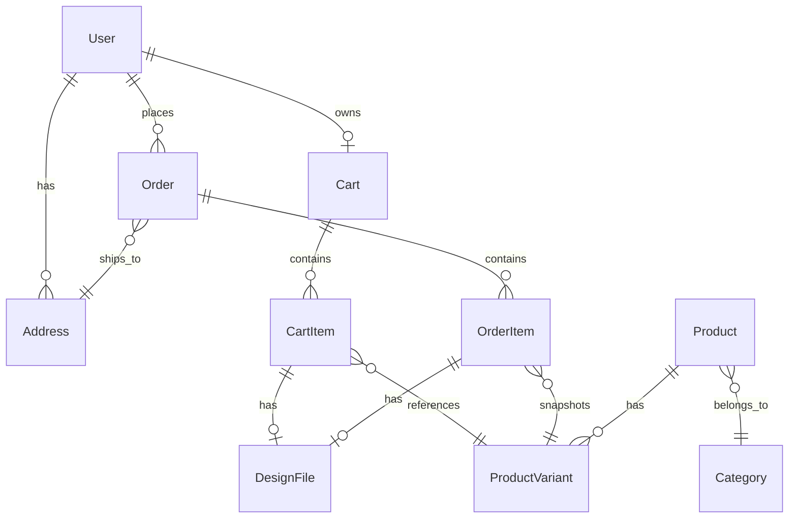
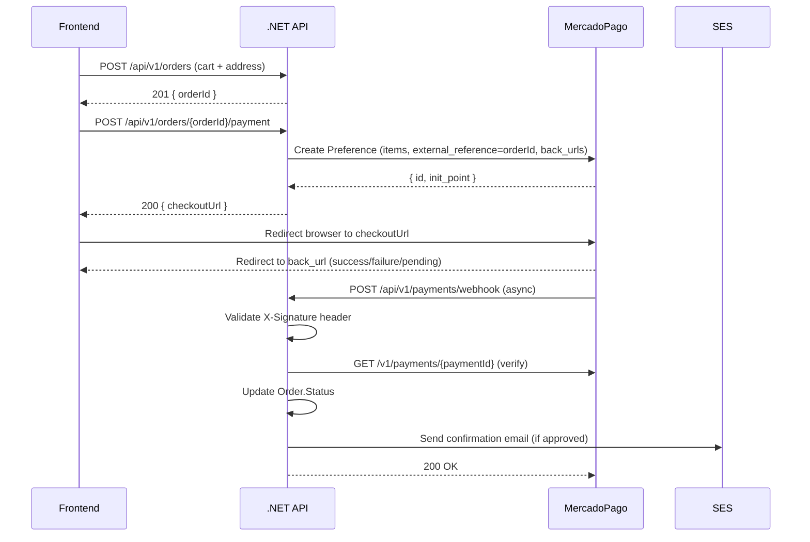
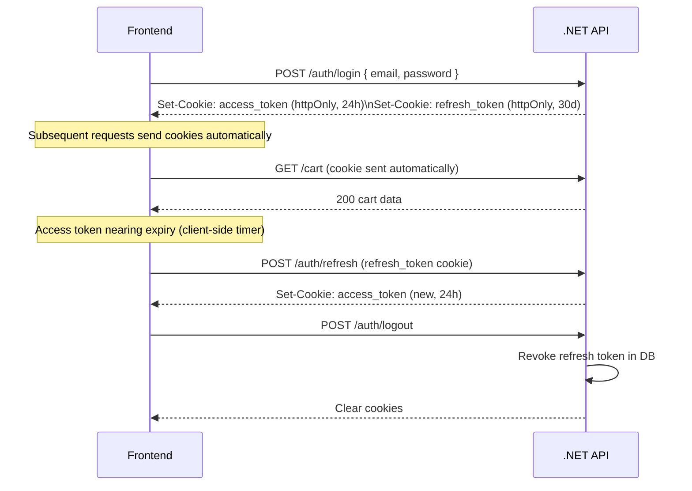

# Design Document — Filamorfosis Online Store

## Overview

The Filamorfosis online store converts the existing brochure/catalog site into a full e-commerce platform. The system is split into two layers:

- **Frontend**: The existing vanilla HTML/CSS/JS site, extended with new pages and modules (`store.js`, `cart.js`, `checkout.js`, `auth.js`) that call the backend API via `fetch()`. No framework is introduced; the existing dark-theme visual identity, multilingual i18n system, and Poppins/Roboto typography are preserved.
- **Backend**: A new C# .NET 8 ASP.NET Core Web API following clean architecture (Domain → Application → Infrastructure → API layers), hosted on AWS, backed by PostgreSQL on RDS.

The two layers communicate exclusively over HTTPS REST. Authentication uses JWT access tokens (24 h) + refresh tokens (30 d), both delivered as `httpOnly` cookies. Guest carts are tracked via a separate `httpOnly` session cookie and merged into the user cart on login/register.

---

## Architecture

```mermaid
graph TD
    subgraph Browser
        FE[Vanilla JS Frontend\nindex.html / products.html\ncart.js / checkout.js / auth.js]
    end

    subgraph AWS
        CF[CloudFront CDN\nStatic assets + S3 images]
        EB[ECS Fargate\n.NET 8 API Container\nSQLite + Litestream]
        SQLite[(SQLite DB\nLitestream → S3)]
        S3[(AWS S3\nDesign files + product images)]
        SES[AWS SES\nTransactional email]
        SM[AWS Secrets Manager\nCredentials & keys]
    end

    subgraph MercadoPago
        MP[MP Hosted Checkout]
        MPW[MP Webhook]
    end

    FE -->|HTTPS fetch()| EB
    FE -->|Static assets| CF
    CF -->|Origin| S3
    EB -->|EF Core| SQLite
    EB -->|SDK| S3
    EB -->|SDK| SES
    EB -->|SDK| SM
    EB -->|REST| MP
    MPW -->|POST /api/v1/payments/webhook| EB
    MP -->|Redirect back URLs| FE
```

### Deployment

- **Compute**: ECS Fargate — containerized .NET 8 API, auto-scaling task definition, no server management.
- **Database**: SQLite file stored on the ECS Fargate task's ephemeral storage. Litestream replicates the SQLite WAL continuously to an S3 bucket (`filamorfosis-db`). On container startup, Litestream restores the latest snapshot from S3 before the API starts. This eliminates RDS costs entirely while providing durable, point-in-time recovery.
- **Static assets**: Served from CloudFront backed by S3; the existing HTML/CSS/JS files are deployed there.
- **Design file uploads**: Stored in a private S3 bucket; accessed by admins via pre-signed URLs (60 min TTL).
- **Secrets**: All credentials (DB connection string, JWT key, MP credentials, SES config) loaded from AWS Secrets Manager at container startup via `IConfiguration` provider.
- **Email**: AWS SES in `us-east-1`; verified sending domain `filamorfosis.com`.
- **Region**: `us-east-1`.

---

## Components and Interfaces

### Backend Layers

```
Filamorfosis.Domain          — Entities, enums, domain events, value objects
Filamorfosis.Application     — Use cases (commands/queries), DTOs, interfaces, validators
Filamorfosis.Infrastructure  — EF Core DbContext, repositories, S3/SES/MP adapters, Identity (uses Microsoft.EntityFrameworkCore.Sqlite)
Filamorfosis.API             — ASP.NET Core controllers, middleware, DI wiring
```

### API Controllers

| Controller | Prefix | Responsibility |
|---|---|---|
| `ProductsController` | `/api/v1/products` | Catalog browsing |
| `CategoriesController` | `/api/v1/categories` | Category listing |
| `AuthController` | `/api/v1/auth` | Register, login, refresh, logout, password reset |
| `UsersController` | `/api/v1/users/me` | Profile, addresses |
| `CartController` | `/api/v1/cart` | Cart CRUD, design file upload |
| `OrdersController` | `/api/v1/orders` | Order creation, history |
| `PaymentsController` | `/api/v1/payments` | MP webhook receiver |
| `AdminOrdersController` | `/api/v1/admin/orders` | Admin order management |
| `AdminProductsController` | `/api/v1/admin/products` | Admin product & variant CRUD |
| `AdminCategoriesController` | `/api/v1/admin/categories` | Admin category management |

### API Endpoint Reference

#### Products & Categories

```
GET  /api/v1/products                     ?page&pageSize&categoryId&search
GET  /api/v1/products/{id}
GET  /api/v1/categories
```

#### Auth

```
POST /api/v1/auth/register
POST /api/v1/auth/login
POST /api/v1/auth/refresh
POST /api/v1/auth/logout
POST /api/v1/auth/forgot-password
POST /api/v1/auth/reset-password
```

#### User Profile

```
GET    /api/v1/users/me
PUT    /api/v1/users/me
POST   /api/v1/users/me/addresses
DELETE /api/v1/users/me/addresses/{addressId}
```

#### Cart

```
GET    /api/v1/cart
POST   /api/v1/cart/items
PUT    /api/v1/cart/items/{itemId}
DELETE /api/v1/cart/items/{itemId}
DELETE /api/v1/cart
POST   /api/v1/cart/items/{itemId}/design
```

#### Orders

```
POST /api/v1/orders
GET  /api/v1/orders
GET  /api/v1/orders/{orderId}
POST /api/v1/orders/{orderId}/payment
```

#### Payments

```
POST /api/v1/payments/webhook
```

#### Admin

```
GET  /api/v1/admin/orders
PUT  /api/v1/admin/orders/{orderId}/status
GET  /api/v1/admin/orders/{orderId}/design-files

GET    /api/v1/admin/products
POST   /api/v1/admin/products
GET    /api/v1/admin/products/{id}
PUT    /api/v1/admin/products/{id}
DELETE /api/v1/admin/products/{id}
POST   /api/v1/admin/products/{id}/variants
PUT    /api/v1/admin/products/{id}/variants/{variantId}
DELETE /api/v1/admin/products/{id}/variants/{variantId}
POST   /api/v1/admin/products/{id}/images

GET  /api/v1/admin/categories
POST /api/v1/admin/categories
PUT  /api/v1/admin/categories/{id}
```

### Frontend Modules

New JS files added alongside the existing codebase:

| File | Responsibility |
|---|---|
| `assets/js/api.js` | Central `fetch()` wrapper, base URL config, cookie-based auth header injection, error normalization |
| `assets/js/auth.js` | Register/login/logout forms, token refresh scheduling, navbar user state |
| `assets/js/cart.js` | Cart state management, cart drawer rendering, add-to-cart animations, guest session cookie |
| `assets/js/checkout.js` | Checkout page logic, address selection, order creation, MP redirect |
| `assets/js/store-i18n.js` | Store-specific translation keys merged into the existing i18n system |
| `checkout.html` | Checkout page (cart summary + shipping form) |
| `order-confirmation.html` | Post-payment success/failure page |
| `account.html` | User profile + order history SPA |

---

## Data Models

### Entity Relationship Overview



### Domain Entities (C#)

#### User
```csharp
public class User : IdentityUser<Guid>
{
    public string FirstName { get; set; }
    public string LastName  { get; set; }
    public string? PhoneNumber { get; set; }
    public DateTime CreatedAt { get; set; }
    public ICollection<Address> Addresses { get; set; }
    public ICollection<Order> Orders { get; set; }
    public Cart? Cart { get; set; }
    // PasswordHash managed by ASP.NET Core Identity (bcrypt cost 12)
}
```

#### Address
```csharp
public class Address
{
    public Guid Id { get; set; }
    public Guid UserId { get; set; }
    public string Street     { get; set; }
    public string City       { get; set; }
    public string State      { get; set; }
    public string PostalCode { get; set; }
    public string Country    { get; set; }
    public bool IsDefault    { get; set; }
}
```

#### Category
```csharp
public class Category
{
    public Guid   Id          { get; set; }
    public string Slug        { get; set; }   // "uv-printing", "3d-printing", etc.
    public string NameEs      { get; set; }
    public string NameEn      { get; set; }
    public string? ImageUrl   { get; set; }
    public ICollection<Product> Products { get; set; }
}
```

#### Product
```csharp
public class Product
{
    public Guid     Id          { get; set; }
    public Guid     CategoryId  { get; set; }
    public string   Slug        { get; set; }
    public string   TitleEs     { get; set; }
    public string   TitleEn     { get; set; }
    public string   DescriptionEs { get; set; }
    public string   DescriptionEn { get; set; }
    public string[] Tags        { get; set; }   // stored as jsonb
    public string[] ImageUrls   { get; set; }   // S3 keys, stored as jsonb
    public bool     IsActive    { get; set; }
    public DateTime CreatedAt   { get; set; }
    public Category Category    { get; set; }
    public ICollection<ProductVariant> Variants { get; set; }
}
```

#### ProductVariant
```csharp
public class ProductVariant
{
    public Guid    Id          { get; set; }
    public Guid    ProductId   { get; set; }
    public string  Sku         { get; set; }
    public string  LabelEs     { get; set; }   // e.g. "30cm × 20cm, PLA Blanco"
    public string  LabelEn     { get; set; }
    public decimal Price       { get; set; }   // MXN
    public bool    IsAvailable { get; set; }
    public bool    AcceptsDesignFile { get; set; }
    public int     StockQuantity { get; set; }  // units currently in stock
    public Product Product     { get; set; }
}
```

#### Cart
```csharp
public class Cart
{
    public Guid      Id          { get; set; }
    public Guid?     UserId      { get; set; }   // null = guest
    public string?   GuestToken  { get; set; }   // cookie value for guests
    public DateTime  UpdatedAt   { get; set; }
    public DateTime  ExpiresAt   { get; set; }   // 30 days for guests
    public ICollection<CartItem> Items { get; set; }
}
```

#### CartItem
```csharp
public class CartItem
{
    public Guid    Id               { get; set; }
    public Guid    CartId           { get; set; }
    public Guid    ProductVariantId { get; set; }
    public int     Quantity         { get; set; }
    public string? CustomizationNotes { get; set; }
    public Guid?   DesignFileId     { get; set; }
    public ProductVariant Variant   { get; set; }
    public DesignFile?    DesignFile { get; set; }
}
```

#### DesignFile
```csharp
public class DesignFile
{
    public Guid     Id          { get; set; }
    public string   S3Key       { get; set; }
    public string   FileName    { get; set; }
    public string   ContentType { get; set; }
    public long     SizeBytes   { get; set; }
    public DateTime UploadedAt  { get; set; }
    public Guid?    UploadedByUserId { get; set; }
}
```

#### Order
```csharp
public class Order
{
    public Guid        Id                  { get; set; }
    public Guid        UserId              { get; set; }
    public Guid        ShippingAddressId   { get; set; }
    public string?     Notes               { get; set; }
    public decimal     Total               { get; set; }   // MXN, snapshot at creation
    public OrderStatus Status              { get; set; }
    public string?     MercadoPagoPreferenceId { get; set; }
    public string?     MercadoPagoPaymentId    { get; set; }
    public DateTime    CreatedAt           { get; set; }
    public DateTime    UpdatedAt           { get; set; }
    public User        User                { get; set; }
    public Address     ShippingAddress     { get; set; }
    public ICollection<OrderItem> Items    { get; set; }
}

public enum OrderStatus
{
    Pending, PendingPayment, Paid,
    InProduction, Shipped, Delivered,
    Cancelled, PaymentFailed
}
```

#### OrderItem
```csharp
public class OrderItem
{
    public Guid    Id               { get; set; }
    public Guid    OrderId          { get; set; }
    public Guid    ProductVariantId { get; set; }   // FK kept for reference
    public string  ProductTitleEs   { get; set; }   // snapshot
    public string  ProductTitleEn   { get; set; }   // snapshot
    public string  VariantLabelEs   { get; set; }   // snapshot
    public string  VariantLabelEn   { get; set; }   // snapshot
    public decimal UnitPrice        { get; set; }   // snapshot
    public int     Quantity         { get; set; }
    public Guid?   DesignFileId     { get; set; }
    public DesignFile? DesignFile   { get; set; }
}
```

#### RefreshToken
```csharp
public class RefreshToken
{
    public Guid     Id        { get; set; }
    public Guid     UserId    { get; set; }
    public string   Token     { get; set; }   // SHA-256 hash stored
    public DateTime ExpiresAt { get; set; }
    public bool     IsRevoked { get; set; }
    public DateTime CreatedAt { get; set; }
}
```

#### PasswordResetToken
```csharp
public class PasswordResetToken
{
    public Guid     Id        { get; set; }
    public Guid     UserId    { get; set; }
    public string   TokenHash { get; set; }   // SHA-256 hash
    public DateTime ExpiresAt { get; set; }
    public bool     IsUsed    { get; set; }
}
```

### Database Schema Notes

- SQLite with EF Core migrations.
- `Product.Tags` and `Product.ImageUrls` stored as JSON strings (TEXT columns, serialized/deserialized via EF Core value converters).
- `OrderStatus` stored as TEXT. Soft-delete via `IsActive` flag.
- Indexes on `Cart.GuestToken`, `Cart.UserId`, `Order.UserId`, `Order.MercadoPagoPaymentId`, `RefreshToken.Token`, `PasswordResetToken.TokenHash`.

---

## MercadoPago Integration Flow



**Preference payload** sent to MercadoPago:
```json
{
  "items": [{ "title": "...", "quantity": 1, "unit_price": 299.00, "currency_id": "MXN" }],
  "external_reference": "<orderId>",
  "back_urls": {
    "success": "https://filamorfosis.com/order-confirmation.html?status=success&orderId=<orderId>",
    "failure": "https://filamorfosis.com/order-confirmation.html?status=failure&orderId=<orderId>",
    "pending": "https://filamorfosis.com/order-confirmation.html?status=pending&orderId=<orderId>"
  },
  "auto_return": "approved",
  "notification_url": "https://api.filamorfosis.com/api/v1/payments/webhook"
}
```

**Webhook validation**: MercadoPago sends an `x-signature` header. The API reconstructs the HMAC-SHA256 signature using the MP webhook secret from Secrets Manager and rejects requests where the signature does not match.

---

## Authentication Flow



**Guest cart merge on login**:
1. Frontend sends the `guest_cart_token` cookie alongside login credentials.
2. API looks up the guest `Cart` by `GuestToken`.
3. For each guest `CartItem`, if the same `ProductVariantId` exists in the user's cart, quantities are summed; otherwise the item is moved.
4. The guest `Cart` record is deleted.
5. The `guest_cart_token` cookie is cleared in the response.

**CSRF protection**: Because auth cookies are `httpOnly` and `SameSite=Strict`, CSRF attacks from cross-origin pages cannot read or send the cookies. For additional defense, the API validates a `X-Requested-With: XMLHttpRequest` header on all state-changing endpoints, which browsers do not send on cross-origin form submissions.

---

## AWS Infrastructure Layout

```
┌─────────────────────────────────────────────────────────┐
│  Route 53                                               │
│  filamorfosis.com → CloudFront (static)                 │
│  api.filamorfosis.com → ALB → ECS Fargate               │
└─────────────────────────────────────────────────────────┘

CloudFront Distribution
  └── Origin: S3 bucket (static site + product images)
  └── Cache behaviors: /api/* → bypass (not cached)

ECS Fargate (us-east-1)
  └── Task: filamorfosis-api (.NET 8 container)
  └── Auto-scaling: 1–4 tasks based on CPU/memory
  └── Secrets injected via Secrets Manager at task start
  └── Entrypoint: litestream replicate -exec "dotnet Filamorfosis.API.dll"
  └── /data volume: SQLite database file (SQLITE_DB_PATH=/data/filamorfosis.db)
  └── IAM task role: s3:GetObject, s3:PutObject, s3:ListBucket on filamorfosis-db

ALB (Application Load Balancer)
  └── HTTPS listener (ACM certificate)
  └── HTTP → HTTPS redirect

S3 Buckets
  └── filamorfosis-static   — public, CloudFront origin
  └── filamorfosis-designs  — private, pre-signed URL access only
  └── filamorfosis-db       — private, Litestream WAL replication target

AWS SES
  └── Verified domain: filamorfosis.com
  └── Templates: welcome, order-confirmation, shipment-notification, password-reset

AWS Secrets Manager
  └── /filamorfosis/prod/jwt-key
  └── /filamorfosis/prod/mp-credentials
  └── /filamorfosis/prod/ses-config
  └── /filamorfosis/prod/litestream-config  (if Litestream config contains sensitive values)
```

---

## Frontend Integration Approach

### API Client (`assets/js/api.js`)

```javascript
const API_BASE = 'https://api.filamorfosis.com/api/v1';

async function apiFetch(path, options = {}) {
    const res = await fetch(`${API_BASE}${path}`, {
        credentials: 'include',          // send httpOnly cookies
        headers: {
            'Content-Type': 'application/json',
            'X-Requested-With': 'XMLHttpRequest',
            ...options.headers
        },
        ...options
    });
    if (res.status === 401) { await tryRefresh(); /* retry once */ }
    if (!res.ok) throw await res.json();
    return res.status === 204 ? null : res.json();
}
```

### Cart Drawer

- A `<div id="cart-drawer">` is injected into every page's `<body>` by `cart.js` on DOM ready.
- Cart state is held in a module-level JS object and synced with the API on every mutation.
- The navbar badge (`<span id="cart-count">`) is updated after every cart operation.
- Add-to-cart animation: the product image flies toward the cart icon using a CSS keyframe animation triggered by JS.

### New Pages

| Page | Route | Description |
|---|---|---|
| `checkout.html` | `/checkout.html` | Cart summary, shipping address form/selector, order total, "Pagar con MercadoPago" button |
| `order-confirmation.html` | `/order-confirmation.html?status=&orderId=` | Reads `status` query param; shows success/failure/pending UI; fetches order details |
| `account.html` | `/account.html` | Tabs: Profile, Addresses, Mis Pedidos; protected — redirects to login modal if unauthenticated |
| `admin.html` | `/admin.html` | Admin-only page; tabs: Products (list + add/edit/delete products, variants, images), Categories (list + add/rename); dark theme, vanilla JS, no framework; redirects non-admins to login |

### Language Integration

`store-i18n.js` exports a flat object of translation keys for all 6 languages and calls the existing `switchLanguage()` hook to merge them into the global translation map. No changes to the existing i18n architecture are needed.

---

## Security Design

| Concern | Mechanism |
|---|---|
| Password storage | ASP.NET Core Identity with bcrypt, cost factor 12 |
| Token transport | `httpOnly`, `Secure`, `SameSite=Strict` cookies |
| CSRF | `SameSite=Strict` + `X-Requested-With` header validation |
| Login brute force | ASP.NET Core rate limiting middleware: 10 req/min/IP on `/auth/login` |
| SQL injection | EF Core parameterized queries; no raw SQL |
| XSS | Input sanitized via FluentValidation; output encoded by JSON serializer |
| File upload | MIME type + extension whitelist (PNG, JPG, SVG, PDF); max 20 MB enforced in middleware |
| Webhook integrity | HMAC-SHA256 signature validation against MP webhook secret |
| Secrets | AWS Secrets Manager; never in source code or `.env` files |
| HTTPS | ALB enforces HTTPS; HTTP → HTTPS redirect; HSTS header set |
| Payment data | Never touches the API; handled entirely by MercadoPago hosted checkout |
| Pre-signed URLs | 60-minute TTL; only Admin role can request them |

---

## Correctness Properties

*A property is a characteristic or behavior that should hold true across all valid executions of a system — essentially, a formal statement about what the system should do. Properties serve as the bridge between human-readable specifications and machine-verifiable correctness guarantees.*

### Property 1: Product catalog filter invariant

*For any* set of products in the database and any valid `categoryId` filter, every product returned by `GET /api/v1/products?categoryId=X` must belong to category X, and no product belonging to category X must be absent from the result (within the requested page).

**Validates: Requirements 1.4**

---

### Property 2: Product search filter invariant

*For any* set of products and any non-empty search term, every product returned by `GET /api/v1/products?search=T` must have a title or description containing T (case-insensitive), and no product whose title or description contains T must be absent from the result.

**Validates: Requirements 1.5**

---

### Property 3: Category product count accuracy

*For any* set of categories and products, the `productCount` returned for each category by `GET /api/v1/categories` must equal the actual number of active products assigned to that category.

**Validates: Requirements 1.3**

---

### Property 4: Minimum variant price display

*For any* product with one or more available variants, the price displayed as "Desde $X" must equal the minimum `Price` across all variants where `IsAvailable = true`.

**Validates: Requirements 1.7**

---

### Property 5: Registration accepts valid credentials

*For any* email address not already in the system and any password meeting the rules (≥ 8 characters, ≥ 1 uppercase letter, ≥ 1 digit), a `POST /api/v1/auth/register` request must succeed with a 201 response and return a valid JWT.

**Validates: Requirements 2.2**

---

### Property 6: Registration rejects duplicate email

*For any* email address already associated with an existing user, a second `POST /api/v1/auth/register` request with that email must return `409 Conflict`, regardless of the password provided.

**Validates: Requirements 2.3**

---

### Property 7: Registration rejects invalid passwords

*For any* password that is shorter than 8 characters, or contains no uppercase letter, or contains no digit, a `POST /api/v1/auth/register` request must return `422 Unprocessable Entity` listing each failing rule.

**Validates: Requirements 2.4**

---

### Property 8: Cart merge on authentication

*For any* guest cart containing N items and any user cart containing M items (with possible variant overlaps), after login or registration the user's cart must contain all variants from both carts, with quantities summed for overlapping variants, and the total item count must be ≥ max(N, M).

**Validates: Requirements 2.6, 3.7**

---

### Property 9: Login round-trip

*For any* registered user, a `POST /api/v1/auth/login` with correct credentials must return a JWT whose expiry is approximately 24 hours from now and a refresh token whose expiry is approximately 30 days from now.

**Validates: Requirements 3.1, 3.2**

---

### Property 10: Login rejects invalid credentials

*For any* (email, password) pair where either the email is not registered or the password does not match, `POST /api/v1/auth/login` must return `401 Unauthorized` with a generic error message that does not distinguish between wrong email and wrong password.

**Validates: Requirements 3.3**

---

### Property 11: Refresh token invalidation after logout

*For any* authenticated user, after calling `POST /api/v1/auth/logout`, any subsequent call to `POST /api/v1/auth/refresh` with the same refresh token must return `401 Unauthorized`.

**Validates: Requirements 3.6**

---

### Property 12: Password reset email for registered users only

*For any* registered email, `POST /api/v1/auth/forgot-password` must trigger an email send (to the email service) and create a reset token with an expiry of approximately 60 minutes. For any unregistered email, the response must be `200 OK` and no email must be sent.

**Validates: Requirements 4.2, 4.3**

---

### Property 13: Password reset round-trip

*For any* registered user who requests a password reset and receives a valid token, submitting that token with a new compliant password must succeed, and the user must subsequently be able to log in with the new password and not with the old one.

**Validates: Requirements 4.4, 4.5**

---

### Property 14: Profile data round-trip

*For any* authenticated user, updating profile fields via `PUT /api/v1/users/me` and then fetching via `GET /api/v1/users/me` must return exactly the values that were submitted. Similarly, adding an address via `POST /api/v1/users/me/addresses` must cause it to appear in the profile response, and deleting it via `DELETE /api/v1/users/me/addresses/{id}` must cause it to disappear.

**Validates: Requirements 5.1, 5.2, 5.3, 5.4**

---

### Property 15: Unauthenticated access returns 401

*For any* endpoint under `/api/v1/users/me` or `POST /api/v1/orders`, a request made without a valid JWT must return `401 Unauthorized`.

**Validates: Requirements 5.5, 8.5**

---

### Property 16: Cart CRUD round-trip

*For any* valid product variant and quantity, adding an item to the cart via `POST /api/v1/cart/items` must cause it to appear in `GET /api/v1/cart`. Updating its quantity via `PUT /api/v1/cart/items/{id}` must be reflected in the next `GET /api/v1/cart`. Deleting it via `DELETE /api/v1/cart/items/{id}` must remove it. Calling `DELETE /api/v1/cart` must result in an empty cart.

**Validates: Requirements 6.1, 6.2, 6.4, 6.6, 6.7**

---

### Property 17: Cart item quantity accumulation

*For any* cart and any product variant already present in that cart, adding the same variant again via `POST /api/v1/cart/items` must increment the existing item's quantity by the submitted amount rather than creating a second entry for the same variant.

**Validates: Requirements 6.3**

---

### Property 18: Design file upload association

*For any* cart item that accepts design files, uploading a valid file (PNG, JPG, SVG, or PDF, ≤ 20 MB) via `POST /api/v1/cart/items/{itemId}/design` must result in the cart item having a non-null `designFileId` when fetched, and the S3 key must be stored.

**Validates: Requirements 7.1, 7.2**

---

### Property 19: Order creation price snapshot

*For any* cart with items at known prices, creating an order via `POST /api/v1/orders` must produce order items whose `unitPrice` values exactly match the variant prices at the time of order creation, regardless of any subsequent price changes to those variants.

**Validates: Requirements 8.2**

---

### Property 20: Cart cleared after order creation

*For any* non-empty cart, after a successful `POST /api/v1/orders`, a subsequent `GET /api/v1/cart` must return an empty cart.

**Validates: Requirements 8.3**

---

### Property 21: MercadoPago preference payload correctness

*For any* order, the preference object sent to MercadoPago must contain the order's ID as `external_reference`, each order item as a line item with the correct title and unit price, and valid `back_urls` for success, failure, and pending states.

**Validates: Requirements 9.2**

---

### Property 22: Webhook status mapping

*For any* incoming webhook notification with a recognized order `external_reference`, the resulting order status must map correctly: `approved` → `Paid` (and email sent), `rejected` → `PaymentFailed`, `pending` → `PendingPayment`. No other status transitions must occur.

**Validates: Requirements 9.5, 9.6, 9.7**

---

### Property 23: Webhook signature validation

*For any* incoming request to `POST /api/v1/payments/webhook` where the `x-signature` header does not match the HMAC-SHA256 of the payload using the MP webhook secret, the API must return `400 Bad Request` and must not update any order.

**Validates: Requirements 9.9**

---

### Property 24: Order list isolation

*For any* two distinct users each with orders, `GET /api/v1/orders` for user A must return only user A's orders and never user B's orders, regardless of how many orders exist in the system.

**Validates: Requirements 10.1**

---

### Property 25: Cross-user order access returns 403

*For any* two distinct authenticated users and an order belonging to user A, a request by user B to `GET /api/v1/orders/{orderId}` must return `403 Forbidden`.

**Validates: Requirements 10.3**

---

### Property 26: Admin endpoint authorization

*For any* user without the `Admin` role, any request to any endpoint under `/api/v1/admin/` must return `403 Forbidden`, regardless of the HTTP method or request body.

**Validates: Requirements 11.1, 11.4**

---

### Property 27: Shipment notification on status update

*For any* order updated to `Shipped` status by an admin via `PUT /api/v1/admin/orders/{orderId}/status`, the email service must be called exactly once with the order user's email address.

**Validates: Requirements 11.3**

---

### Property 28: Translation map completeness

*For any* store UI translation key defined in `store-i18n.js` and any of the 6 supported languages (ES, EN, DE, PT, JA, ZH), the translation value must be a non-empty string. Similarly, for any API error code returned by the backend, the frontend error translation map must contain a non-empty translation for all 6 languages.

**Validates: Requirements 13.1, 13.2, 13.4**

---

### Property 29: Language persistence round-trip

*For any* language selection stored to `localStorage`, reading the stored value and applying it on page load must result in the same language being active as was selected.

**Validates: Requirements 13.5**

---

### Property 30: Password hashing strength

*For any* plaintext password submitted during registration or password reset, the value stored in the database must be a valid bcrypt hash with a cost factor of at least 12, and the plaintext must not appear anywhere in the stored hash.

**Validates: Requirements 14.2**

---

### Property 31: Input sanitization rejects injection payloads

*For any* user-supplied input field containing SQL injection patterns (e.g., `'; DROP TABLE`) or XSS payloads (e.g., `<script>alert(1)</script>`), the API must either reject the request with a 422 response or store the value in escaped form such that it cannot be executed.

**Validates: Requirements 14.6**

---

### Property 33: Admin product CRUD round-trip

*For any* product created via `POST /api/v1/admin/products` with valid fields, fetching it via `GET /api/v1/admin/products/{id}` must return exactly the submitted values. Updating it via `PUT /api/v1/admin/products/{id}` and fetching again must reflect the updated values. Deleting it via `DELETE /api/v1/admin/products/{id}` must cause `GET /api/v1/admin/products/{id}` to return a product with `isActive = false`.

**Validates: Requirements 15.2, 15.3, 15.4, 15.5**

---

### Property 34: Admin variant stock quantity round-trip

*For any* product variant created or updated via the admin variants endpoints, the `stockQuantity` value returned by `GET /api/v1/admin/products/{id}` must exactly match the value that was submitted.

**Validates: Requirements 15.6, 15.7, 15.10**

---

### Property 35: Admin product image upload association

*For any* valid image file (PNG or JPG, ≤ 10 MB) uploaded via `POST /api/v1/admin/products/{id}/images`, the resulting S3 key must appear in the product's `imageUrls` array when the product is subsequently fetched.

**Validates: Requirements 15.9**

---

### Property 36: Admin product/category endpoint authorization

*For any* user without the `Admin` role, any request to any endpoint under `/api/v1/admin/products` or `/api/v1/admin/categories` must return `403 Forbidden`, regardless of HTTP method or request body.

**Validates: Requirements 15.14**

---

### Property 32: CSRF header enforcement

*For any* state-changing request (POST, PUT, DELETE) to the API that uses cookie-based authentication and does not include the `X-Requested-With: XMLHttpRequest` header, the API must return `400 Bad Request` and must not process the request.

**Validates: Requirements 14.7**

---

## Error Handling

### API Error Response Format (RFC 7807)

All error responses use the Problem Details format:

```json
{
  "type": "https://filamorfosis.com/errors/validation-failed",
  "title": "Validation Failed",
  "status": 422,
  "detail": "One or more fields failed validation.",
  "errors": {
    "password": ["Must be at least 8 characters", "Must contain at least one uppercase letter"]
  }
}
```

### Error Code → Frontend Translation

The frontend `store-i18n.js` maps API error `type` URIs to localized messages. The API always returns English `detail` strings; the frontend selects the localized version by `type`.

### Status Code Conventions

| Scenario | HTTP Status |
|---|---|
| Successful creation | 201 Created |
| Successful update/action | 200 OK |
| No content | 204 No Content |
| Validation failure | 422 Unprocessable Entity |
| Duplicate resource | 409 Conflict |
| Unauthenticated | 401 Unauthorized |
| Insufficient permissions | 403 Forbidden |
| Resource not found | 404 Not Found |
| Rate limit exceeded | 429 Too Many Requests |
| Invalid webhook signature | 400 Bad Request |
| Empty cart on order creation | 400 Bad Request |

### Resilience Patterns

- **MP SDK failures**: If the MercadoPago SDK call fails during preference creation, the order remains in `Pending` status and the API returns `502 Bad Gateway`. The frontend shows a retry option.
- **SES failures**: Email sending is fire-and-forget with structured logging. A failed email does not roll back the order or registration.
- **S3 upload failures**: If S3 upload fails, the API returns `502 Bad Gateway` and the design file is not associated with the cart item. The client can retry.
- **Webhook idempotency**: Webhook processing checks if the order is already in the target status before updating, preventing duplicate email sends on MP retries.

---

## Testing Strategy

### Dual Testing Approach

Both unit tests and property-based tests are required. They are complementary:

- **Unit tests** (xUnit): specific examples, integration points, edge cases, error conditions.
- **Property-based tests** (FsCheck for .NET): universal properties across randomly generated inputs.

### Unit Test Coverage

Unit tests focus on:
- Specific happy-path examples for each API endpoint (using `WebApplicationFactory`)
- Edge cases: empty cart order, zero-quantity update, expired tokens, unknown webhook reference
- Integration points: EF Core repository queries, S3 adapter, SES adapter, MP SDK adapter (all mocked with Moq)
- Error condition examples: duplicate email registration, invalid file type upload, cross-user order access

Avoid writing unit tests that duplicate what property tests already cover across many inputs.

### Property-Based Test Configuration

- **Library**: FsCheck + FsCheck.Xunit (`dotnet add package FsCheck.Xunit`)
- **Minimum iterations**: 100 per property (FsCheck default is 100; configure via `[Property(MaxTest = 100)]`)
- **Generators**: Custom Arbitrary instances for `User`, `Product`, `ProductVariant`, `Cart`, `CartItem`, `Order`
- **Tag format**: Each property test must include a comment: `// Feature: online-store, Property N: <property_text>`

### Property Test Mapping

| Design Property | Test Class | Test Method |
|---|---|---|
| P1: Category filter invariant | `ProductCatalogPropertyTests` | `CategoryFilter_ReturnsOnlyMatchingProducts` |
| P2: Search filter invariant | `ProductCatalogPropertyTests` | `SearchFilter_ReturnsOnlyMatchingProducts` |
| P3: Category product count | `CategoryPropertyTests` | `ProductCount_MatchesActualCount` |
| P4: Minimum variant price | `ProductPricePropertyTests` | `DesdePrice_IsMinimumAvailableVariantPrice` |
| P5: Registration valid creds | `AuthPropertyTests` | `Register_ValidCredentials_Succeeds` |
| P6: Registration duplicate email | `AuthPropertyTests` | `Register_DuplicateEmail_Returns409` |
| P7: Registration invalid password | `AuthPropertyTests` | `Register_InvalidPassword_Returns422` |
| P8: Cart merge on auth | `CartMergePropertyTests` | `CartMerge_CombinesItemsCorrectly` |
| P9: Login round-trip | `AuthPropertyTests` | `Login_ValidCredentials_ReturnsCorrectTokenExpiry` |
| P10: Login invalid creds | `AuthPropertyTests` | `Login_InvalidCredentials_Returns401Generic` |
| P11: Refresh invalidation after logout | `AuthPropertyTests` | `Logout_InvalidatesRefreshToken` |
| P12: Password reset email behavior | `PasswordResetPropertyTests` | `ForgotPassword_RegisteredEmail_SendsEmail_UnregisteredEmail_DoesNot` |
| P13: Password reset round-trip | `PasswordResetPropertyTests` | `ResetPassword_ValidToken_AllowsLoginWithNewPassword` |
| P14: Profile data round-trip | `UserProfilePropertyTests` | `ProfileUpdate_RoundTrip_PreservesValues` |
| P15: Unauthenticated returns 401 | `AuthorizationPropertyTests` | `ProtectedEndpoints_WithoutAuth_Return401` |
| P16: Cart CRUD round-trip | `CartPropertyTests` | `CartCrud_RoundTrip_ReflectsChanges` |
| P17: Cart quantity accumulation | `CartPropertyTests` | `AddSameVariant_AccumulatesQuantity` |
| P18: Design file upload association | `DesignFilePropertyTests` | `ValidFileUpload_AssociatesWithCartItem` |
| P19: Order price snapshot | `OrderPropertyTests` | `OrderCreation_SnapshotsPricesAtCreationTime` |
| P20: Cart cleared after order | `OrderPropertyTests` | `OrderCreation_ClearsCart` |
| P21: MP preference payload | `PaymentPropertyTests` | `PreferencePayload_ContainsCorrectFields` |
| P22: Webhook status mapping | `WebhookPropertyTests` | `WebhookStatus_MapsToCorrectOrderStatus` |
| P23: Webhook signature validation | `WebhookPropertyTests` | `InvalidSignature_Returns400_NoOrderUpdate` |
| P24: Order list isolation | `OrderPropertyTests` | `OrderList_ReturnsOnlyCurrentUserOrders` |
| P25: Cross-user order 403 | `OrderPropertyTests` | `CrossUserOrderAccess_Returns403` |
| P26: Admin endpoint authorization | `AdminAuthorizationPropertyTests` | `AdminEndpoints_NonAdminUser_Returns403` |
| P27: Shipment notification | `AdminOrderPropertyTests` | `StatusUpdateToShipped_SendsEmailOnce` |
| P28: Translation map completeness | `I18nPropertyTests` | `AllTranslationKeys_HaveNonEmptyValuesForAllLanguages` |
| P29: Language persistence | `I18nPropertyTests` | `LanguageSelection_PersistsAcrossPageLoad` |
| P30: Password hashing strength | `SecurityPropertyTests` | `StoredPassword_IsBcryptWithCostAtLeast12` |
| P31: Input sanitization | `SecurityPropertyTests` | `InjectionPayloads_AreRejectedOrEscaped` |
| P32: CSRF header enforcement | `SecurityPropertyTests` | `StateMutatingRequests_WithoutXRequestedWith_Return400` |
| P33: Admin product CRUD round-trip | `AdminProductPropertyTests` | `AdminProductCrud_RoundTrip_ReflectsChanges` |
| P34: Admin variant stock quantity round-trip | `AdminProductPropertyTests` | `AdminVariantStockQuantity_RoundTrip_PreservesValue` |
| P35: Admin product image upload association | `AdminProductPropertyTests` | `AdminImageUpload_AppendsS3KeyToProduct` |
| P36: Admin product/category authorization | `AdminAuthorizationPropertyTests` | `AdminProductCategoryEndpoints_NonAdminUser_Returns403` |

### Frontend Testing

- **Unit tests**: Jest for pure JS functions (cart total calculation, price formatting, translation key lookup, language persistence logic).
- **Property tests**: fast-check (npm) for frontend property tests (P4, P28, P29).
- **Integration**: Manual smoke tests for cart drawer, checkout flow, and MP redirect in staging environment.
